# Antventure: Game Design Document

### Table of Contents

- [Game Overview](#game-overview)
  - [Core Concept](#core-concept)
  - [Related Genre](#related-genre)
  - [Target Audience](#target-audience)
  - [Unique Selling Points (USPs)](#unique-selling-points-usps)
- [Story and Narrative](#story-and-narrative)
  - [Backstory](#backstory)
  - [Characters](#characters)
- [Gameplay and Mechanics](#gameplay-and-mechanics)
  - [Player Perspective](#player-perspective)
  - [Controls](#controls)
  - [Progression](#progression)
  - [Gameplay Mechanics](#gameplay-mechanics)
- [Levels and World Design](#levels-and-world-design)
  - [Game World](#game-world)
  - [Objects](#objects)
  - [Physics](#physics)
- [Art and Audio](#art-and-audio)
  - [Art Style](#art-style)
  - [Sound and Music](#sound-and-music)
  - [Assets](#assets)
- [UI](#ui)
  - [UI/UX Flow](#uiux-flow)
  - [In-Game HUD (Heads-Up Display)](#in-game-hud-heads-up-display)
  - [Menu Details](#menu-details)
  - [Interaction & Feedback](#interaction--feedback)
- [Technology and Tools](#technology-and-tools)
- [Team Communication, Timelines and Task Assignment](#team-communication-timelines-and-task-assignment)
- [Possible Challenges](#possible-challenges)

---

## Game Overview

### Core Concept

Players take on the role of a brave little ant on a quest to reclaim cookies stolen by greedy seagulls. From the ant's perspective, the everyday, overlooked human environment transforms into a giant, perilous playground. Players must traverse kitchens, street flower beds, and outdoor areas, ultimately reaching the pier. Overcoming countless obstacles, they'll utilize unique abilities—summoning fellow ants, spraying venom, and cooperative combat—to solve puzzles, overcome barriers, and finally face the seagull in an ultimate showdown. The game's title, *Antventure*, is a portmanteau of "Ant" and "Adventure," reflecting the grand journey of our tiny protagonist.
Step into the ant's world through their eyes!

### Related Genre

1.  3D platformer + light puzzle adventure
2.  Inspirations include *Pikmin* (group coordination), *It Takes Two* (creative level design), and *Grounded* (miniature perspective).
3.  Unlike these titles, our game offers a short, focused experience (~10 minutes) built around summoning mechanics and ant biology, featuring creative environmental puzzles viewed from a microscopic perspective.

### Target Audience

#### Primary Audience
- **Light puzzle and action-platformer players**
  - Enjoy quick onboarding and replayable levels; willing to try unique perspectives and creative mechanics.
- **Edutainment / science-curious players**
  - Prefer "learn-while-playing": ant pheromone trails, swarm intelligence, venom/acid spray, adhesive pads, living bridges/ant structures, etc.
- **Casual players and content creators (game reviewers/streamers/short-form video)**
  - Need strong, eye-catching hooks (e.g., reviewing a University of Melbourne IT student project), and low-cost replay/commentary (short levels, fail-without-punishment).

#### Secondary Audience
- **City & culture enthusiasts**
  - Local student groups who enjoy observing Melbourne's everyday life and culture.

### Unique Selling Points (USPs)

-   **Summoning Mechanics:** Collecting cookie crumbs summons ant helpers (worker ants assist in combat, while nest-building ants construct bridges/ladders). This introduces strategy and variety within the game's short playtime.
-   **Creative Environmental Interaction:** Each level features unique obstacles: kitchen stovetops, milk cartons, curbside stone paths, flower beds requiring hopping over, and docks coveted by the street's dominant seagulls.
-   **Science Micro-Facts (Edutainment):** Bite-sized ant facts (pheromone trails, swarm intelligence, venom/acid spray, adhesive pads, living bridges/ant ladders) are unlocked as you play; presented as optional HUD tips and loading-screen cards for “learn-while-playing.”

---

## Story and Narrative

### Backstory

In the hidden corners of Melbourne lies a world unnoticed by humans—the kingdom of ants. Within this miniature realm, a single ordinary cookie is like a legendary treasure bestowed by the gods, capable of altering the fate of an entire ant colony.

The story begins on a tranquil morning. The protagonist is a small ant, stubborn and brave. It stumbles upon a fallen cookie on the kitchen counter—a “golden feast” in ant terms. Just as it prepares to feast, a cunning pigeon swoops through the window, snatching the cookie and leaving scattered crumbs behind. To humans, this is an insignificant scene, but in the eyes of the little ant, it is a challenge from fate and a call to adventure.

In the ant's worldview, human kitchens, streets, and docks were not ordinary spaces, but towering labyrinths and raging battlefields. Human food became colossal obstacles, the pull of sewer pipes felt like the apocalypse, and a single leaking pipe could drown an entire colony.

To reclaim its precious cookie, the little ant embarks on a journey of pursuit and resistance. It is not alone: food scraps gathered along the way summon companions. Ants unite to carry burdens, build bridges, and ward off dangers. Through this journey, the protagonist evolves into a leader—no longer merely a food-seeking individual, but a vanguard guiding its colony toward glory.

The ultimate adversary is the tyrannical seagull—a “dragon” in the ant world, symbolizing the oppression and arrogance of the outside world. Only by defeating it can the little ant prove that even the most insignificant life can leave its own mark of victory in the vast world.

### Characters

-   **The Protagonist Ant (Player Character)**
   -   **Role:** The hero controlled by the player, on an adventure to reclaim the cookie.
   -   **Personality & Motivation:** Brave and determined, it fears nothing despite its tiny size. Its core drive is to reclaim the precious cookie stolen by the pigeon, a mission of honor for the entire ant colony.
   -   **Appearance:** A stylized, earth-toned (sandy brown) ant with simple texturing on its body for detail. Features a smooth, six-legged crawling animation, making its movement look natural and insect-like.
   -   **Abilities:** Can run, jump, climb walls, and grab (with the C key) small objects (e.g., sugar cubes). Also possesses the ability to summon specific support ants and spray venom.
-   **The Pigeon (Main Antagonist)**
    -   **Role:** The final boss and the greedy thief who stole the cookie.
    -   **Personality & Motivation:** Arrogant and possessive, it views the ant's world as its personal pantry, plundering at will.
    -   **Appearance:** From the ant's perspective, it is a massive and intimidating grey pigeon, with detailed feathers and threatening animations.
    -   **Role in Gameplay:** Appears as the boss in the dock level. Its attack patterns include: a fast pecking motion with its beak, and periodically flapping its wings to create strong gusts of wind that can push the ant back or create obstacles.
-   **Helper Ants (Worker, Builder, etc.)**
    -   **Role:** AI-controlled allies summoned by the protagonist ant, crucial for solving puzzles and overcoming level challenges. 
-   **Insects (Environmental Enemies)**
    -   **Role:** Hostile creatures encountered in the second level (Outdoor) flower bed area, acting as dynamic environmental hazards that the player must avoid or confront.
    -   **Scale & Design:** While small to humans, from the ant's perspective these insects are formidable in size and threat. They are designed to appear as large, intimidating adversaries.
    -   **Behavior System:** Insects move in five organized columns across the flower bed, traveling in opposite directions with randomized speeds and spacing. This creates an unpredictable migration pattern that simulates a coordinated colony movement, replacing the original fixed back-and-forth patrol system. The dynamic behavior enhances gameplay variety and challenge.
    -   **Types:**
        -   **Red Ladybugs:** These insects carry cookie crumbs on their backs, making them primary targets for resource collection. Their spawn rate is dynamically controlled—linked to the number of cookies already collected in the flower bed area. Once the player has collected five cookies in this zone, no more cookie-carrying ladybugs will appear, creating strategic scarcity.
        -   **Black Beetles:** These insects do not carry resources and serve purely as obstacles. They increase the difficulty of navigating through the flower bed and force players to use their venom ability strategically.
    -   **Interaction & Death Effect:** These insects can be defeated by the protagonist's Venom Shot ability (left mouse button). When hit, insects undergo a dramatic multi-stage death sequence:
        1. **Collapse Phase:** The insect's body begins to crumple inward toward its center
        2. **Dissolution Phase:** The body progressively dissolves and becomes transparent
        3. **Dissipation Phase:** Fire and ember particle effects burst from the body, simulating the corrosive melting effect of the venom
        -   This sophisticated death animation combines vertex deformation shaders with dissolve effects and particle systems, replacing the original simple explosion effect with a more realistic and visually compelling representation of poison's corrosive action.

---

## Gameplay and Mechanics

### Player Perspective

The game employs a dynamic third-person perspective. Players control an ant character that remains permanently visible at the center of the screen. The camera system automatically adjusts based on the environment: providing a standard follow-cam perspective on flat terrain, while switching angles in special scenarios (such as vertical walls) to ensure a seamless experience. The character design blends cartoonish elements with realistic styling—preserving fundamental ant characteristics while avoiding potentially unsettling hyper-realistic details through stylized cartooning.

### Controls

-   **Movement control:** WASD keys control the character's movement in all directions.
-   **Jumping action:** Pressing the space will perform a normal jump.
-   **Pick up：** The "C" key is used for grabbing/picking up objects. 
-   **Environmental Interaction:** The "E" key is used for interacting with scene objects and summoning points.
-   **Launch attack:** Left mouse button is used to shoot venom.
-   **Viewpoint control:** Adjust the camera direction by moving the mouse.
-   **Special operation:** The "J" key is used to escape from a trapped situation. The "V" key is used for some special gameplay methods.

### Progression

-   **Level structure:**
    -   **Tutorial Level: ~1 min:** Set in a simplified environment to teach the player the core controls: MOUSE to adjust viewpoint,WASD movement, Space for jumping, and C for grabbing objects.
    -   **Teaching level (kitchen area) 1.5-2min:** Introduces environmental hazards and basic puzzles using the learned controls.
    -   **Main level (outdoor mixed environment) 4-6min :** Integrates garden and Melbourne street elements with customized gameplay mechanics, introducing a complete summoning system
    -   **Ultimate Challenge (Beach Boss Battle) 1-2min:** Requires the comprehensive application of all the skills learned so far
-   **Difficulty assessment:**
    -   Gradual introduction of new mechanisms.
    -   Each level features multiple save points, providing ample opportunity to practice each mechanic.
    -   The Boss battle focuses on strategy rather than operational difficulty.
-   **Failure and Renewal:**
    -   **Failure conditions:** Being attacked by enemies (such as being pecked by pigeons) or coming into contact with dangerous environments (such as falling into water)
    -   Using the checkpoint respawn system, after death, one can quickly restart from the most recent node.
    -   Simplify the health system and adopt a one-hit-death mechanism but combine it with quick respawn to maintain the game pace.
-   **Continuous play motivation comes from:**
    -   Collect food scraps to unlock the skin color of the new ant character.
    -   Each level features multiple hidden food scraps to encourage exploration (linked to the summoning mechanism for the final boss battle).
    -   The time record function for completing the game can be considered to encourage repeated challenges.

### Gameplay Mechanics

-   **Core mechanism:**
    -   **Basic movement system:** Running, jumping, wall-climbing movement
    -   **Environmental Interaction:**
        -   Interact with the preset trigger point (e.g., stove switch, spider)
        -   Interacting with dynamic obstacles (e.g., moving vegetables, water pipes)
        -   **Carrying Mechanics Evolution:** In Level 1, the ant carries objects by placing them on its back. In Level 2, this evolves into a more anthropomorphic interaction—the ant grasps a leaf parachute by its stem and holds it overhead, creating a more dynamic and expressive visual presentation that enhances the game's personality and charm.
    -   **Combat & Venom System:** The player ant can fire venom projectiles (left mouse button) to defeat insects in Level 2's flower bed area. When insects are hit by venom, they undergo a dramatic death sequence: collapsing inward, dissolving, and dissipating with particle effects, simulating the corrosive action of the poison. This combat system is essential for navigating through the organized insect migration patterns in the flower bed.
    -   **Team collaboration:** Summon a limited number of ants to assist in completing the mission.
-   **Summoning Skill:**
    -   **Summoning Resources:** Food scraps need to be collected as the summoning energy. Each summoning consumes one scrap.
    -   **Type of helper ants:**
        -   **Wall-Crawlers:** Jet-black ants. They can defy gravity to scurry quickly across specific vertical surfaces (e.g., walls, cabinet sides), used to activate out-of-reach switches or open new paths for the protagonist.
        -   **Soldiers:** Browny-yellow ants, sturdier than workers. They are the primary units summoned for the final boss fight. Once summoned, Soldiers will automatically lock onto and charge towards the Pigeon boss to attack, providing constant distraction and damage without requiring player manual control.
    -   The summoning point is fixed at a specific location and requires sufficient debris to be gathered before it can be summoned.
-   **Physical system:**
    -   Implementing the standard gravity model and collision detection
    -   Obstacles move along the predetermined path.

---

## Levels and World Design

### Game World

The game is set in a fully 3D environment, but with level design that encourages movement and gameplay primarily on a two-dimensional plane, creating a 2.5D-style experience. Each level follows a linear progression structure while incorporating several areas for exploration. There is no mini map, but visual cues about the level layout assist in navigation.

### Objects

-   **player (ant):**
    <p align="center">
      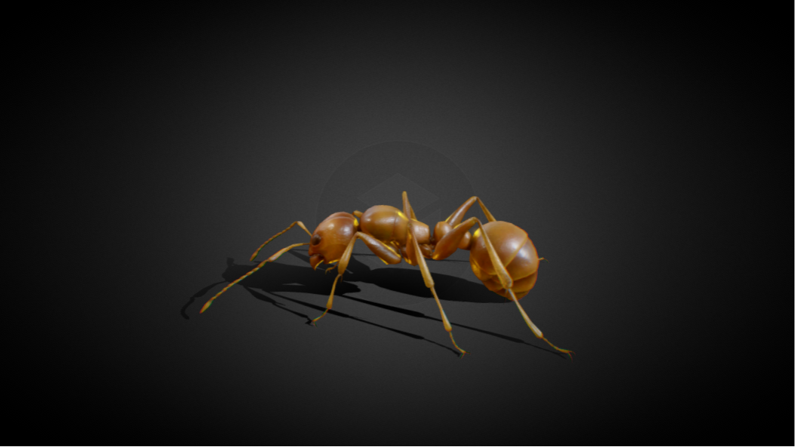
    </p>
-   **The tutorial level (desk):**
    <p align="center">
      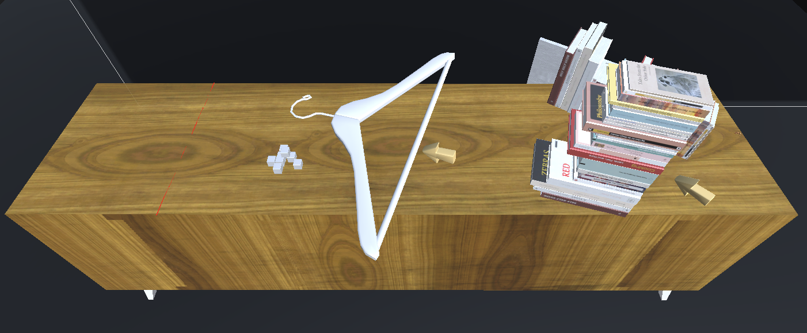
    </p>

    -   **Teaching UI:** Players will receive instructional guidance after each section of the road, which is convenient for them to pass the subsequent levels.
        -   **Books:** Teach the player control left and right and adjust the perspective to go around
        -   **Handle:** Teach the player jump over it
        -   **Sugar Cubes:** Teach players pick up things and pass the level

-   **The first level (kitchen):**
    <p align="center">
      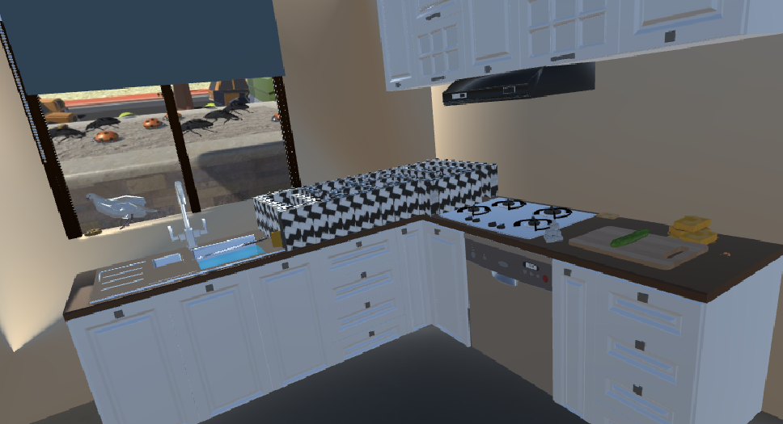
    </p>
    
    -   **Checkpoint System:** A checkpoint is activated after overcoming each primary obstacle. Upon death, the player respawns at the most recently activated checkpoint.
    -   **Obstacles & Puzzles:**
        -   **Rolling Cucumber:** A cucumber rolling back and forth on a cutting board, which the player must time their jump to overcome.
        -   **Sugar Cube Puzzle**: The player must grab (C) a sugar cube and carry it to a designated slot. Placing the cube correctly extinguishes the flames on a stovetop, allowing passage. 
        -   **Milk Carton Maze:** A maze constructed from towering milk cartons. The player must navigate through it to find the exit.
        <p align="center">
          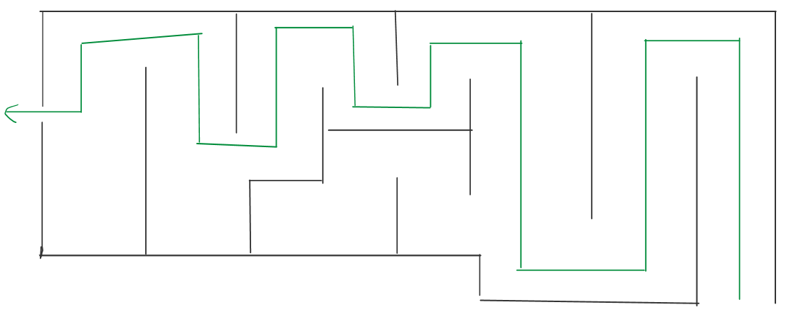
        </p>
        
        -    **Cake Spatula Bridge:** A long cake spatula spans over a sink filled with water. The player must carefully cross this narrow bridge. Falling into the water results in failure.

-   **Second Level (Outdoor Comprehensive :Street & Flower Beds):**
    <p align="center">
      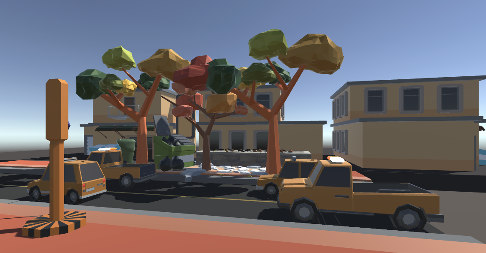
    </p>

    -   **Obstacles & Puzzles:**
      -   **Timed Wall-Climb Survival:** The player must explore the stone path area within a time limit and successfully climb the wall. If time runs out, the continuous water flow from a pipe will flood the area and cause failure.
      -   **Conditional Summon Climb:** The player must promptly use the summoning skill to climb onto the flower bed to avoid the incoming water—but only after collecting enough cookie crumbs (energy).
        <p align="center">
          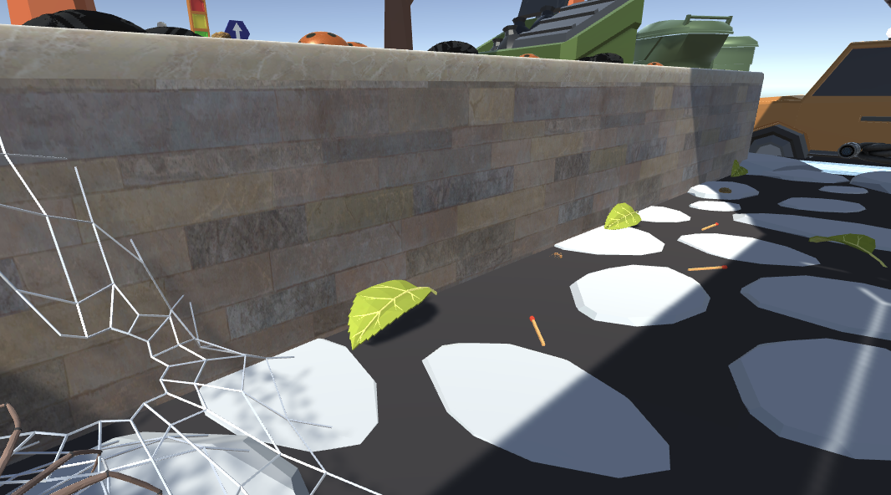
        </p>
      -   **Venom Run Through the Flower Bed:** Navigate through a five-lane flower bed filled with organized insect traffic. Use the left mouse button to fire venom at approaching insects.
        -   **Insect Behavior:** Five columns of insects move in opposite directions with randomized speeds and spacing, simulating an organized colony migration pattern rather than predictable back-and-forth movement. This dynamic system creates varied gameplay experiences and increases challenge unpredictability.
        -   **Insect Types:**
            -   **Red Ladybugs:** Carry cookie crumbs on their backs. These are the primary targets for cookie collection. The spawn rate of ladybugs is dynamically linked to the number of cookies already collected in this area—once five cookies are collected, no more cookie-carrying ladybugs will appear.
            -   **Black Beetles:** Do not carry cookies and serve as additional obstacles.
        -   **Brick Barriers:** Strategically placed brick cube obstacles prevent players from bypassing the flower bed challenge, ensuring engagement with the insect mechanics.
        -   **Death Effect:** When hit by venom, insects undergo a dramatic multi-stage death animation: the body first collapses inward, then dissolves and dissipates, simulating the corrosive melting effect of the poison. This effect combines shaders with particle systems for a visually compelling result, replacing the original explosion effect with a more realistic toxin interaction.

            <p align="center">
              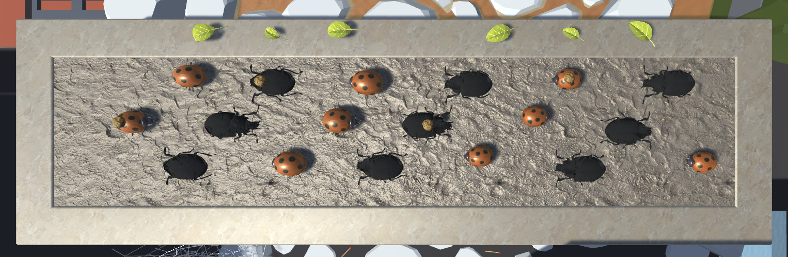
            </p>

            **Three-Stage Death Animation:**

            <p align="center">
              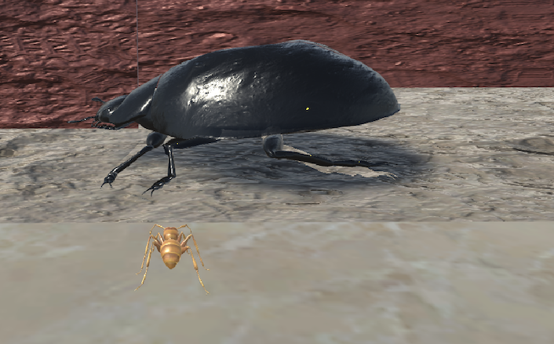
              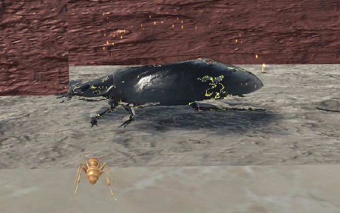
              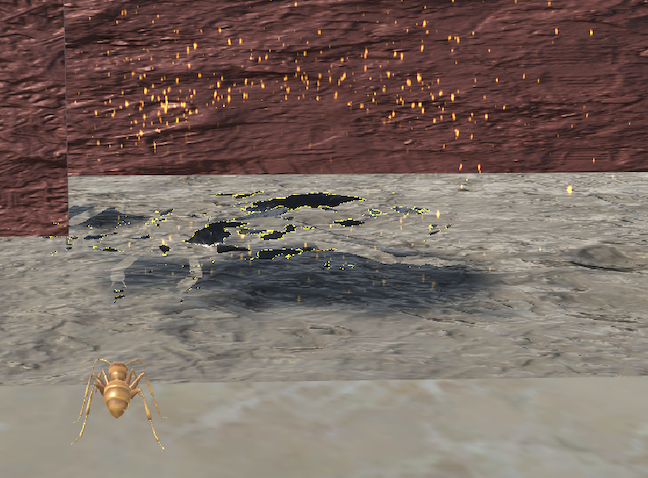
            </p>
      -   **Leaf Parachute:** Discover that leaves can be used as a "parachute" to increase drag, preventing fatal falls when dropping from the flower bed. The ant anthropomorphically grasps the leaf stem and holds it above, creating a charming and visually engaging animation that enhances the game's personality. This design evolved from the simple "object on back" mechanic used in Level 1 to a more dynamic and expressive interaction.
        <p align="center">
          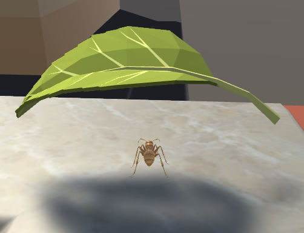
        </p>
      -   **Charged Rock Hops & “Trash Soup”:** Perform charged jumps across multiple rocks to avoid the sticky “trash soup” on the ground, which can trap the player repeatedly and lead to unavoidable death.
      -   **Global Exploration Events:** Multiple optional areas can be explored, but they may trigger unexpected environmental effects (risk–reward tradeoffs).
      -   **Hidden Progress Condition:** Through repeated attempts, players will discover that collecting as many cookie crumbs as possible in Level 2 directly affects whether they can use the summoning skill to repel the BOSS in Level 3. Cookie collection in the flower bed is strategically limited—only red ladybugs carry cookies, and their spawn rate decreases as more cookies are collected, with no cookie-carrying insects appearing after five cookies are obtained in this area.
        <p align="center">
          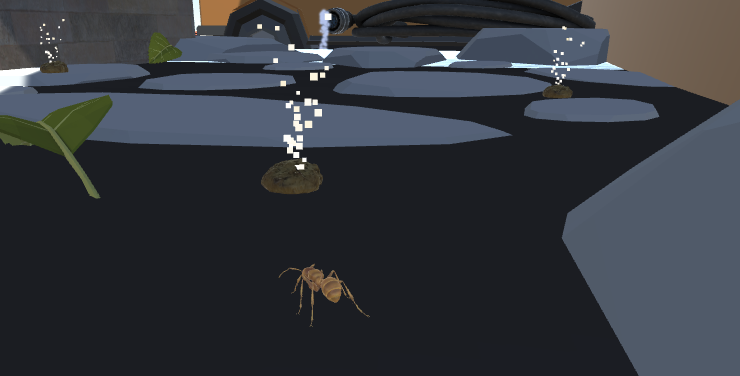
        </p>
      -   **Cinematic Ending Sequence:** The level concludes with a carefully choreographed camera sequence featuring Melbourne's distinctive pedestrian crossing sounds (the iconic ticking and chirping signals). The camera follows the ant's perspective as it crosses the street to reach the beach dock on the opposite side. This sequence balances visual interest with sophisticated cinematography, providing a smooth and aesthetically pleasing transition while maintaining the miniature perspective that makes the game unique.


-   **The third level (Boss battle at the dock):**
    <p align="center">
      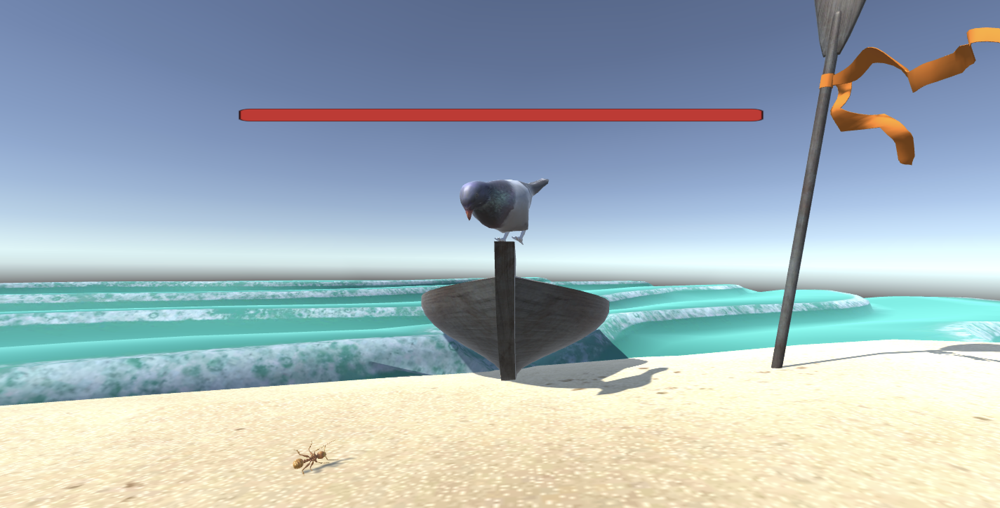
    </p>
    
    -   **Player Actions**
        -   Manual Attack (left click)
            Shoots a straight-line poison projectile (no auto-aim). Requires line-of-sight and positioning.
            Damage: 5 per hit. Cooldown: ~0.3s.
        -   Special Summon (K)
            Instantly spawns 1 Ant Minions around the player by costing 1 cookie collected from level 2. Minions stay near the player and auto-target the Boss, firing their own projectiles.
            Damage: 1 per minion hit. Lifetime / fire interval: short, then despawn.
    -   **Boss (Pigeon):**
        -   Health: 200 HP with a visible boss health bar.
        -   Takes damage from both the player’s poison shots and minion projectiles.

    -   **Win Condition:**
        -   Reduce the Boss HP to 0.

### Physics

-   Basic gravity simulation and collision detection
-   The jumping action is influenced by the gravitational acceleration.
-   The motion of objects follows simplified physical laws.

---

## Art and Audio

### Art Style

-   **Main Art Style:**
    - Stylized cartoon realism with semi-realistic textures to highlight the miniature perspective of ants in a human-scale world.
-   **Game outlook:**
    - 3D side-scroller platformer rendered with 3D assets; environments and hazards appear oversized compared to the ant protagonist, emphasizing scale contrast.
-   **Art**
    -   **Color**
        - **Kitchen**: warm tones (wood, metal gray, yellow lighting)
        - **Garden**: Simple earthy browns with soft, sunlit effects
        - **Urban Street Scene**: Constructed using low-poly assets, featuring an upbeat, sunny palette with slightly elevated saturation
        - **Road**: Deep asphalt gray base with red running lanes, maintaining a steady, grounded tone
        - **Dock**: cool grays and blues, wooden planks, reflective water surfaces
    -   **Shape**
        - Rounded and exaggerated for safe/interactive objects; jagged and sharp for hazards like knives, claws, and debris.
    -   **Texture**
        - Hand-painted textures for food scraps and natural elements; metals, soil, sandy beaches, sea surfaces, and stone exhibit semi-realistic surfaces.
-   **Aesthetic:**
    - Each stage contrasts domestic, natural, and urban-industrial environments. The progression blends playful exploration with increasing danger, culminating in large-scale boss encounters.
-   **Concept art:**
    - Ant protagonist with customizable skins, oversized kitchen props as platforms, sewer dripping pipes, rooftop pigeon boss scene.
-   **Similar art styles:**
    - Grounded, Hollow Knight, Little Nightmares.

### Sound and Music

-   **Sound Design:**
    - Dynamic environmental sound layers (water flowing through pipes, sewer suction sounds) combined with character interactions and hazard warning effects.
-   **Base Sound Effects:**
    - Pickup sounds, poison spray sounds, explosion sounds, wind sounds, pigeon screeching.
- **Interactive Feedback:**
    - Clear audio cues for danger (e.g., spider silk-spinning), collection reward feedback (food gathering sound), and platform jumping (powered jump sound) with enhanced auditory reinforcement.
-   **Music used:**
    - **Kitchen**: playful orchestral with plucked strings
    - **Garden**: Soft, natural element ambient soundscape
    - **Highway**: Sound effects and custom melodies integrated with player actions and narrative progression (synchronized with camera movement). Features authentic **Melbourne pedestrian crossing sounds**—the iconic ticking and chirping signals that characterize the city's crosswalks—adding cultural authenticity during Level 2's cinematic ending sequence as the ant crosses the street.
    - **Dock/Boss**: dramatic orchestral with heavy percussion and tension-filled crescendos
-   **Fitness:**
    - Adaptive music system that changes with player state (Summon Advance/BOSS Battle) to maintain immersion and tension.

### Assets

-   **Artistic assets:**
    - Ant Character Model (Base Model + Skins + animation)
    <p align="center">
      
    </p>
    
    - Kitchen Props (Knives, Cucumbers, Milk Cartons, Cutting Boards, Honey block, sugar square)
    <p align="center">
      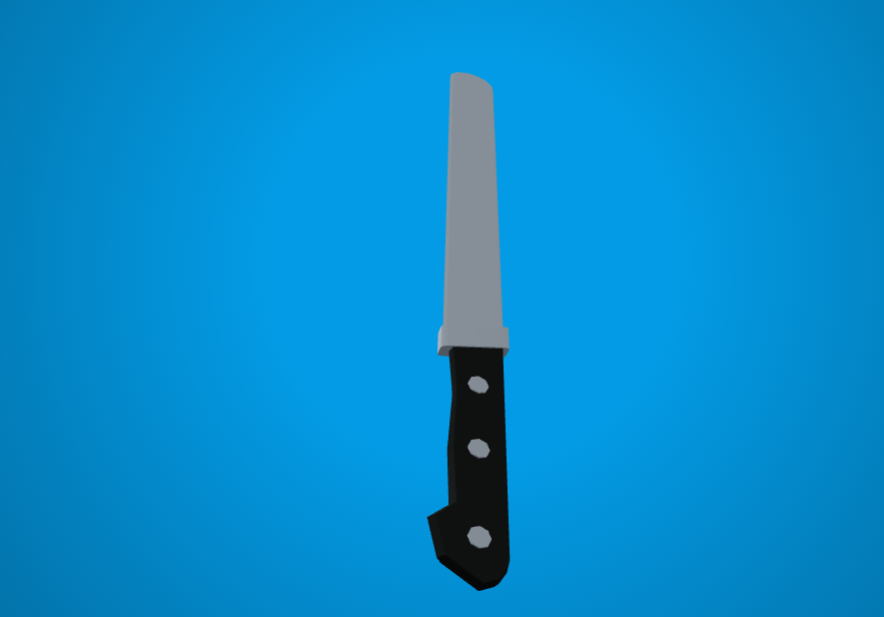
    </p>

    <p align="center">
      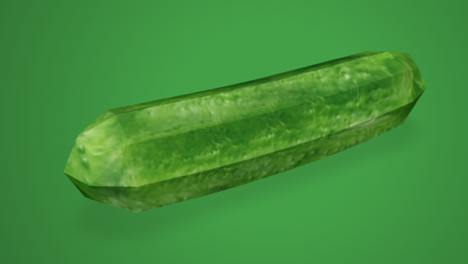
    </p>
    
    <p align="center">
      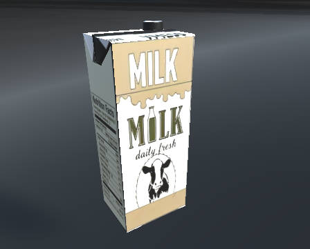
    </p>

    <p align="center">
      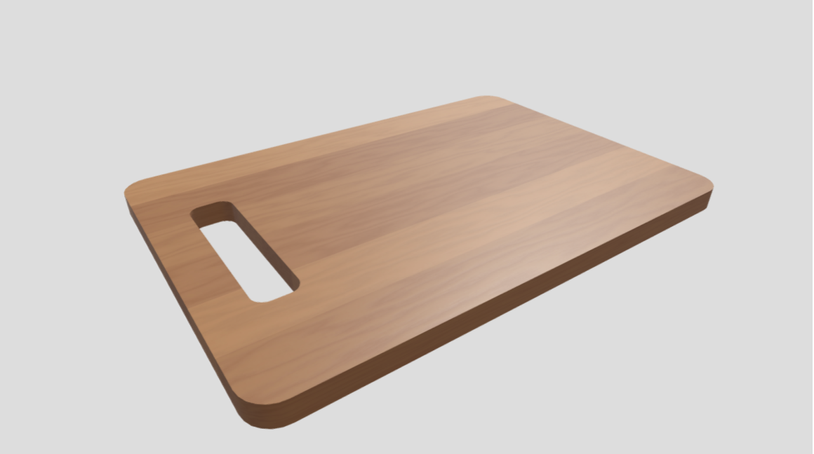
    </p>

    <p align="center">
      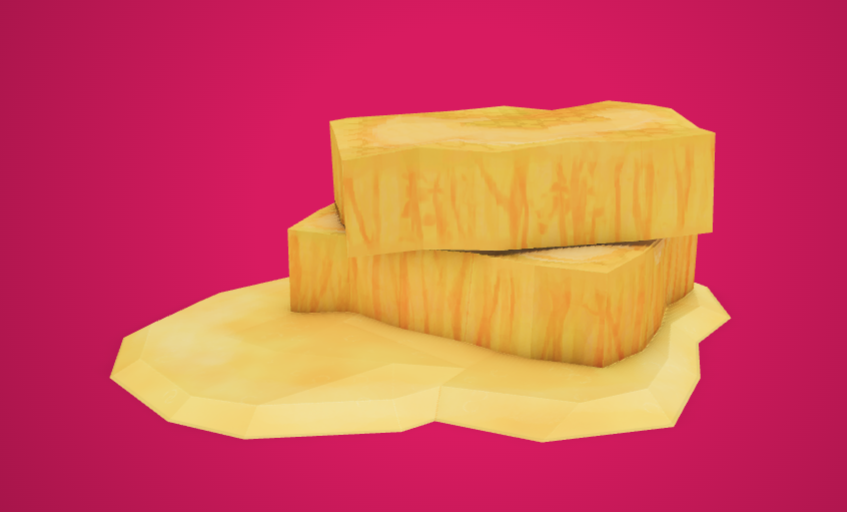
    </p>

    <p align="center">
      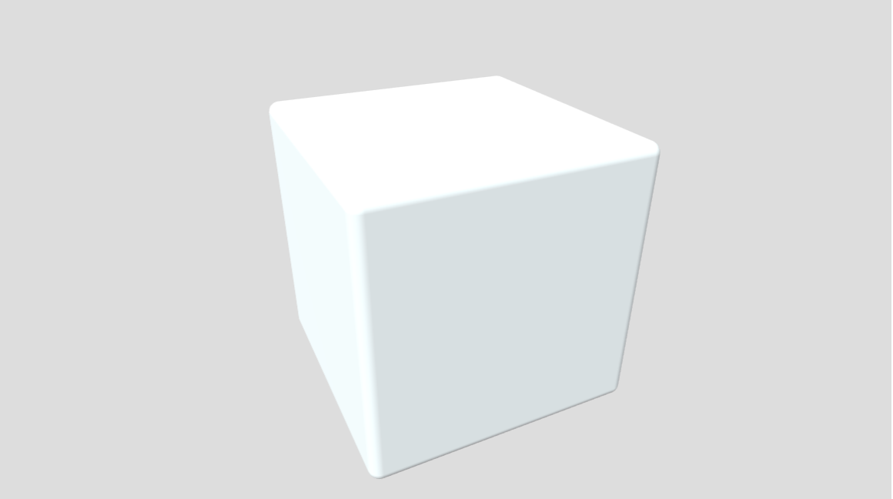
    </p>

    - Garden Resources (Gardens, Soil, Insect NPCs including Red Ladybugs and Black Beetles, Water Pipes, Leaves for Parachute, Matches, Brick Obstacles)
    - Road Resources (Vehicles, Traffic Signs, Trash Cans, Trees, Buildings)
    
    - Beach Assets (Wooden Boat, Sea Surface, Beach, Pigeon Boss Model)
    <p align="center">
      
    </p>  

    <p align="center">
      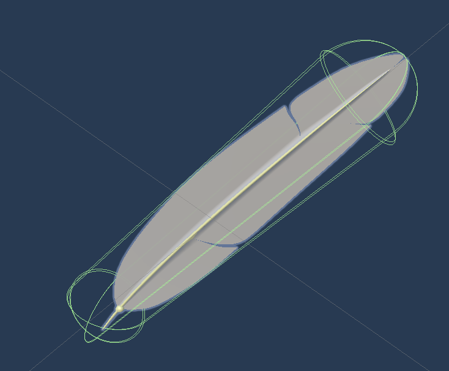
    </p> 

    - Enemies (Pigeon Boss)
    <p align="center">
      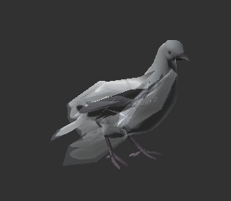
    </p> 
    
    - Collectibles (Food Scraps)
    - Special Effects (Venom Particles, Water Reflection/Refraction Shader, Dissolve Shader with Particle System)
    <p align="center">
      
      
      
    </p>

    <p align="center">
      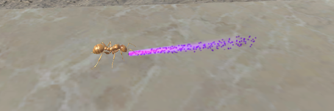
    </p>

-   **Create source:**
    - Blender/Maya (3D models)
    - Substance Painter/Photoshop (textures)
    - Unity Particle System (VFX)
    - GrageBand
    - Musescore
-   **List of candidate assets**
    - Kitchen tableware, bush foliage, street props, dockside cranes, insect enemies, pigeon animations, hazard effects.


---

## UI

-   **UI Tools:** Figma, Photoshop, Unity Canvas
-   **Resources:** Custom cursor designs, UI icons, hand-drawn interface elements

### Custom Cursor System
The game features a custom cursor system with two distinct designs:

**Cursor Types:**
- **Default Cursor:** Arrow pointer for general navigation
- **Hover Cursor:** Hand icon indicating interactive elements

<p align="center">
  
  
</p>

**Cursor Behavior:**
- **Main Menu & Settings:** Visible, switches between default and hover on buttons
- **Active Gameplay:** Hidden and locked for immersion
- **Pause Menu (ESC):** Automatically shows when paused, hides when resumed

**Platform Optimization:**
- Desktop: 64x64 original size
- WebGL: Auto-scaled to 32x32 for browser window mode
- Managed by `UnifiedCursorManager` for consistent behavior across all scenes

### UI Flow
```
Main Menu (Start Scene) → [Play/Tutorial] → In-Game → [ESC] → Pause Menu
     ↓                                                              ↓
Settings Panel ←------------------------------------------------ Exit
```

### Main Menu
- **Play Button (A):** Start game
- **Tut Button (B):** Tutorial level
- **Settings Icon (⚙️):** Audio settings panel

<p align="center">
  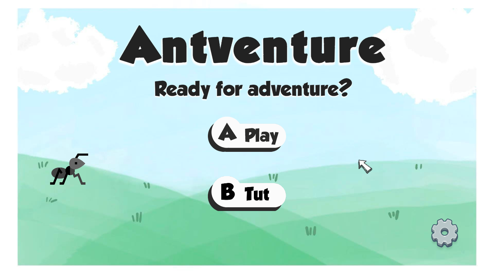
</p>

### Settings Panel
Audio controls accessible from main menu:
- **Music Volume:** 0-100% slider with real-time preview
- **SFX Volume:** Independent sound effects control
- Settings persist via PlayerPrefs

<p align="center">
  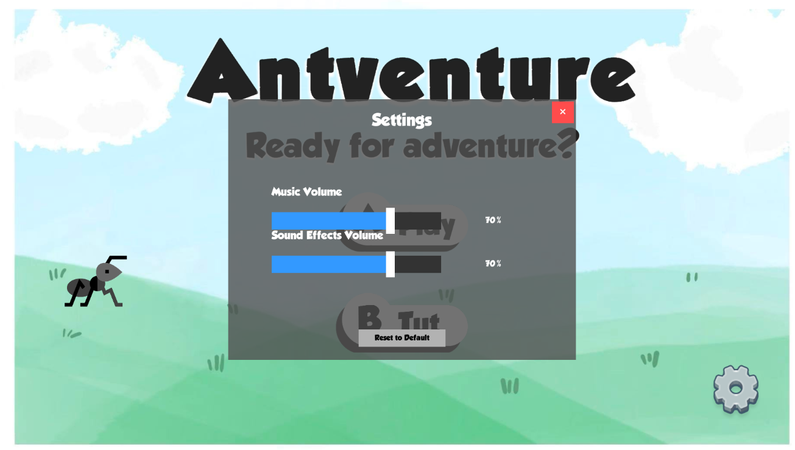
</p>

### In-Game HUD
Minimalist display showing:
- Cookie crumb counter
- Summoned ants status
- Interaction prompts (Press E/C)
- Objective text

<p align="center">
  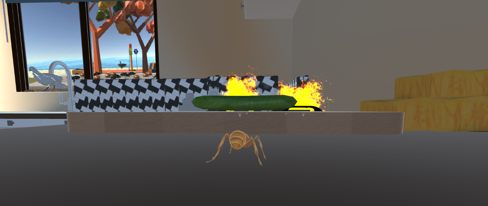
</p>

### Pause Menu (ESC)
Accessible during gameplay by pressing ESC:
- **Resume:** Return to game
- **Music/SFX Sliders:** Adjust audio in real-time
- **Exit:** Return to main menu
- Pauses all physics (Time.timeScale = 0)

<p align="center">
  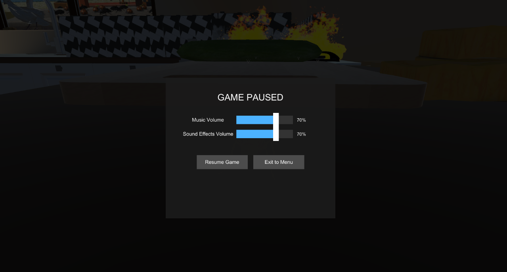
</p>

### UI Interactions
- **Hover:** 105% scale, 90% opacity, hand cursor
- **Click:** 95% scale, audio feedback
- **Audio:** Subtle sounds for hover/click/slider adjustments

---

## Technology and Tools

- **Game Engine**: Unity (C# scripting, 3D platforming workflow)
- **Physics & Animation**: Unity Physics3D, Mecanim Animator, Particle System
- **Art Tools**: Blender, Maya, Substance Painter, Photoshop, Illustrator
- **Audio Tools**: MuseScore, GrageBand
- **Collaboration Tools**: GitHub (version control), Monday (management), Slack/WeChat (team communication)
- **Extra Middleware**: FMOD or Wwise for adaptive sound; ProBuilder for rapid prototyping


---

## Team Communication, Timelines and Task Assignment

We primarily use WeChat for daily communication and quick updates, while Slack is used for structured discussions and file sharing. For task allocation and timeline tracking, we rely on Monday.com to assign responsibilities, set deadlines, and monitor progress.

-   **Communication Tool:**
    -   Wechat
    -   Slack
-   **Timeline Management:** [https://student493091.monday.com/boards/2072589284](https://student493091.monday.com/boards/2072589284)

---

## Possible Challenges

-   **Asset Acquisition and Modeling:**
    -   Finding or creating suitable 3D models that match the miniature ant perspective and stylized art direction proved challenging. Many off-the-shelf assets were too realistic or not properly scaled for the ant's viewpoint.
    -   Creating custom insect models (ladybugs, beetles) with appropriate detail levels for both gameplay clarity and visual appeal required significant iteration.

-   **Technical Implementation Complexity:**
    -   **Dynamic Water System:** Creating real-time reflection and refraction for the water shader with acceptable performance on various hardware configurations required careful optimization.
    -   **Shader Development:** Implementing the dissolve shader with vertex deformation for enemy death effects required combining Surface Shader framework with custom vertex manipulation, which was technically demanding. (Note: The dissolve shader uses Unity's Surface Shader framework for visual effects only. The two shaders submitted for assessment are custom vertex/fragment shaders: KitchenSinkFoam and HoneyWater.)
    -   **Insect AI Behavior:** Developing the five-lane randomized movement system for insects while maintaining performance with multiple active entities was challenging.

-   **Level Design and Gameplay Balance:**
    -   Balancing the difficulty of the flower bed section—ensuring players engage with combat mechanics while not creating excessive frustration—required extensive playtesting and iteration.
    -   Managing the cookie collection economy (limiting spawns, controlling progression to Level 3) needed careful tuning to prevent players from bypassing intended challenges.

-   **Time Constraints:**
    -   With too many ambitious ideas and limited development time, prioritization was crucial. Some features had to be simplified or cut (e.g., WaterWaves.cs was disabled in the final build).
    -   Balancing feature development with polish time meant continuous negotiation between adding new mechanics and refining existing ones.

-   **Cross-Platform Compatibility:**
    -   Ensuring consistent shader performance across different graphics hardware, particularly for the complex water reflection/refraction system, required platform-specific optimization.

-   **Cultural Localization:**
    -   Integrating Melbourne-specific elements (pedestrian crossing sounds) authentically while keeping the game accessible to international audiences required careful audio design and cultural research.

---

## Credits

-   **Audio:** Epidemic Sound (licensed tracks), edited with GarageBand
-   **3D Assets:** Unity Asset Store, Sketchfab, custom modeling (Blender/Maya)
-   **Development:** Unity Engine, C# scripting
-   **Tools:** GitHub (version control), Monday.com (project management)

*For detailed references and technical resources, please refer to [REPORT.md](REPORT.md).*

---

*This game was developed as a university project for COMP30019 at the University of Melbourne.*


