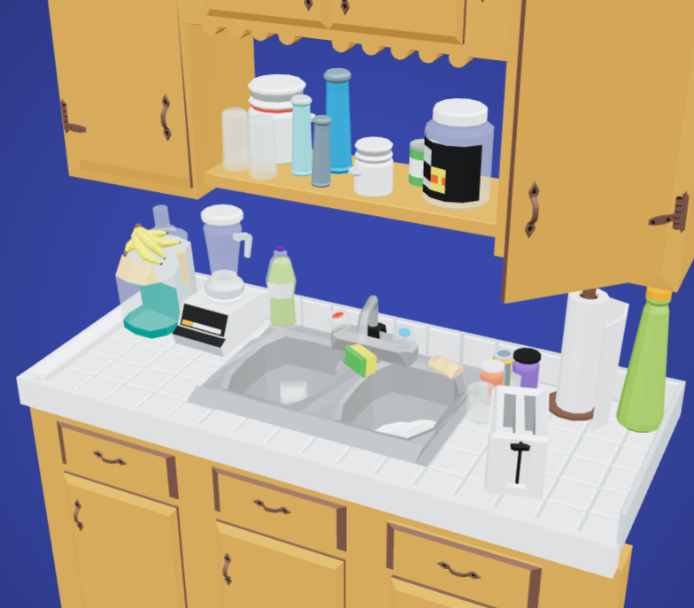
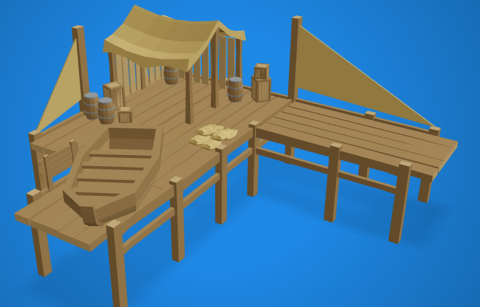
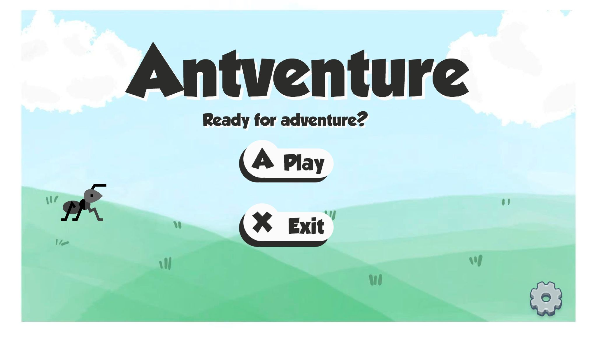
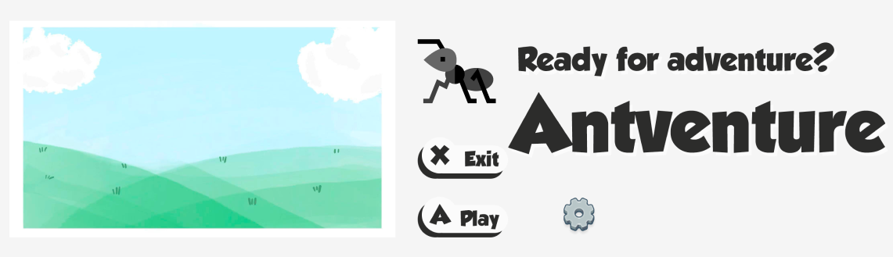

# Antventure: Game Design Document

### Table of Contents

- [Game Overview](#game-overview)
  - [Core Concept](#core-concept)
  - [Related Genre](#related-genre)
  - [Target Audience](#target-audience)
  - [Unique Selling Points (USPs)](#unique-selling-points-usps)
- [Story and Narrative](#story-and-narrative)
  - [Backstory](#backstory)
  - [Characters](#characters)
- [Gameplay and Mechanics](#gameplay-and-mechanics)
  - [Player Perspective](#player-perspective)
  - [Controls](#controls)
  - [Progression](#progression)
  - [Gameplay Mechanics](#gameplay-mechanics)
- [Levels and World Design](#levels-and-world-design)
  - [Game World](#game-world)
  - [Objects](#objects)
  - [Physics](#physics)
- [Art and Audio](#art-and-audio)
  - [Art Style](#art-style)
  - [Sound and Music](#sound-and-music)
  - [Assets](#assets)
- [UI](#ui)
  - [UI/UX Flow](#uiux-flow)
  - [In-Game HUD (Heads-Up Display)](#in-game-hud-heads-up-display)
  - [Menu Details](#menu-details)
  - [Interaction & Feedback](#interaction--feedback)
- [Technology and Tools](#technology-and-tools)
- [Team Communication, Timelines and Task Assignment](#team-communication-timelines-and-task-assignment)
- [Possible Challenges](#possible-challenges)

---

## Game Overview

### Core Concept

The player takes on the role of a brave little ant on a quest to reclaim a stolen French fry from a greedy seagull. From the perspective of an insect, everyday environments become giant and dangerous playgrounds. Players must traverse kitchens, streets, and outdoor areas, overcoming hazards and using the unique ability to summon fellow ants to solve puzzles, cross obstacles, and ultimately confront the seagull in a final showdown. The game's title, *Antventure*, is a portmanteau of "Ant" and "Adventure," reflecting the grand journey of our tiny protagonist.

### Related Genre

1.  3D platformer + light puzzle adventure
2.  Inspirations include *Pikmin* (group coordination), *It Takes Two* (creative level design), and *Grounded* (miniature perspective).
3.  Unlike these titles, our game emphasizes **Melbourne’s cultural** elements (seagulls, trams, café tables) while delivering a short, focused experience (~10 minutes) built around the summoning mechanic.

### Target Audience

*(Please fill in details about the target audience)*

### Unique Selling Points (USPs)

-   **Summoning Mechanic:** Collect fry crumbs to summon different types of ants (workers for carrying, builders for bridges/ladders, soldiers for defense). This introduces strategy and variety within a short playtime.
-   **Creative Environmental Interactions:** Each level features unique obstacles: bubble machines in the kitchen, car traffic and shoe gaps on the street, puddles requiring bridges, and fishing lines or water spouts during the boss fight.
-   **Miniature Melbourne Setting:** The game is built with recognizable Melbourne landmarks (streets, cafés, seaside piers), turning the familiar into adventurous landscapes.

---

## Story and Narrative

### Backstory

In the hidden corners of Melbourne lies a world unnoticed by humans—the kingdom of ants. Within this miniature realm, a single ordinary French fry is like a legendary treasure bestowed by the gods, capable of altering the fate of an entire ant colony.

The story begins on a tranquil morning. The protagonist is a small ant, stubborn and brave. It stumbles upon a fallen French fry on the kitchen counter—a “golden feast” in ant terms. Just as it prepares to feast, a cunning seagull swoops through the window, snatching the fry and leaving scattered crumbs behind. To humans, this is an insignificant scene, but in the eyes of the little ant, it is a challenge from fate and a call to adventure.

In the ants' worldview, human kitchens, streets, cafes, and docks are not ordinary spaces, but towering labyrinths and turbulent battlefields. Tableware becomes colossal obstacles, human footsteps on the streets feel like impending doom, and a single drop of coffee could drown an entire squad.

To reclaim its precious french fry, the little ant embarks on a journey of pursuit and resistance. It is not alone: food scraps gathered along the way summon companions. Ants unite to carry burdens, build bridges, and ward off dangers. Through this journey, the protagonist evolves into a leader—no longer merely a food-seeking individual, but a vanguard guiding its colony toward glory.

The ultimate adversary is the tyrannical seagull—a “dragon” in the ant world, symbolizing the oppression and arrogance of the outside world. Only by defeating it can the little ant prove that even the most insignificant life can leave its own mark of victory in the vast world.

### Characters

*(Please add character details here)*

---

## Gameplay and Mechanics

### Player Perspective

The game adopts a dynamic third-person perspective. The player need to control the ant character, and this character is always visible in the center of the screen. The camera system will adjust according to the environment. Provide the standard following view in flat terrain. In special scenarios (such as the vertical wall of a kitchen), the viewing angle will automatically rotate , thereby creating an immersive spatial experience. The character is designed in a polygonal form, which not only retains the basic features of an ant but also avoids any potentially uncomfortable realistic details through cartoonish treatment.

### Controls

-   **Movement control:** WASD keys control the character's movement in all directions.
-   **Jumping action:** Pressing the space will perform a normal jump.
-   **Environmental Interaction:** The “E” key is used for interacting with scene objects and summoning points.
-   **Acceleration capability:** The “Shift” key triggers a short-term acceleration movement. There is a cooling mechanism in place to prevent abuse.
-   **Viewpoint control:** Adjust the camera direction by moving the mouse.
-   **Special operation:** When close to the wall, press the space bar to activate the wall-following movement mode.

### Progression

-   **Level structure:**
    -   **Teaching level (kitchen area) 1.5-2min:** Gradually guide players to master movement, jumping and basic interaction.
    -   **Main level (outdoor mixed environment) 4-6min :** Integrates shrubbery and street elements, and introduces a complete summoning mechanism
    -   **Ultimate Challenge (Dock Boss Battle) 2-4min:** Requires the comprehensive application of all the skills learned so far
-   **Difficulty assessment:**
    -   Gradual introduction of new mechanisms.
    -   Each mechanism offers ample opportunities for practice.
    -   The Boss battle focuses on strategy rather than operational difficulty.
-   **Failure and Renewal:**
    -   **Failure conditions:** Being attacked by enemies (such as being pecked by pigeons) or coming into contact with dangerous environments (such as falling into water)
    -   Using the checkpoint respawn system, after death, one can quickly restart from the most recent node.
    -   Simplify the health system and adopt a one-hit-death mechanism but combine it with quick respawn to maintain the game pace.
-   **Continuous play motivation comes from:**
    -   Collect food scraps to unlock the skin color of the new ant character.
    -   Set several hidden collectibles for each level to encourage exploration.
    -   The time record function for completing the game can be considered to encourage repeated challenges.

### Gameplay Mechanics

-   **Core mechanism:**
    -   **Basic movement system:** Running, jumping, wall-climbing movement
    -   **Environmental Interaction:**
        -   Interact with the preset trigger point
        -   Interacting with dynamic obstacles (such as moving chopsticks, dripping faucets)
    -   **Team collaboration:** Summon a limited number of ants to assist in completing the mission.
-   **Summoning Skill:**
    -   **Summoning Resources:** Food scraps need to be collected as the summoning energy. Each summoning consumes one scrap.
    -   **Type of helper ants:**
        -   **Worker ants:** Transport small objects, activate mechanisms, assist in defeating the boss.
        -   **Assembly ants:** Constructing simple bridges and stairs
    -   The summoning point is fixed at a specific location and requires sufficient debris to be gathered before it can be summoned.
-   **Physical system:**
    -   Implementing the standard gravity model and collision detection
    -   Obstacles move along the predetermined path.

---

## Levels and World Design

### Game World

With a 2.5D design, the gameplay takes place on a two-dimensional plane but is rendered using 3D models. Each level follows a linear progression structure, but there are a few branching paths for exploration. There is no mini map, but visual cues about the level layout assist in navigation.

### Objects

-   **player (ant):**
    

      
    

-   **The first level (kitchen):**
    

      
    

    

      
    

    -   **Static obstacles:** Sink, kitchenware (requiring detour or jumping over)
    -   **Dynamic obstacles:**
        -   Rolling pin (moving along a fixed path)
        -   Intermittent water droplets (triggered regularly)
    -   **Interactive elements:**
        -   Honey Zone: After entering, the speed slows down and remains at that level for a period.
-   **Second Level (Outdoor Comprehensive):**
    

      
    

    -   **Collection item:** Food scraps
    -   **Summoning Point:** Fixed location, capable of summoning worker ants or assembly ants
    -   **Environmental challenges:**
        -   Small puddle: Requires assembly ants to build a bridge
        -   Mobility obstacle: Insects with simple path movement capabilities
-   **The third level (Boss battle at the dock):**
    

      
    

    -   **Boss Attack Mode:**
        -   Wings flap the air: This phenomenon occurs periodically and requires hiding behind a fixed object.
    -   **Resource Management:** During the Boss battle, food crumbs will drop. Need to collect them in time to maintain the summoning ability.
    -   **Interaction mechanism:**
        -   Trap the boss: Press E to let the worker ants to trap.
        -   Water faucet: Worker ant interaction, triggers water spraying animation.

### Physics

-   Basic gravity simulation and collision detection
-   The jumping action is influenced by the gravitational acceleration.
-   The motion of objects follows simplified physical laws.

---

## Art and Audio

### Art Style

-   **Main Art Style:**
    - Stylized cartoon realism with semi-realistic textures to highlight the miniature perspective of ants in a human-scale world.
-   **Game outlook:**
    - 2.5D side-scroller platformer rendered with 3D assets; environments and hazards appear oversized compared to the ant protagonist, emphasizing scale contrast.
-   **Art**
    -   **Color**
        - **Kitchen**: warm tones (wood, metal gray, yellow lighting)
        - **Street**: muted browns and grays with neon accents
        - **Sewer**: dark greens and browns with reflective wet surfaces
        - **Rooftop**: sharp contrast of blue sky, gray concrete, and pigeon feathers
    -   **Shape**
        - Rounded and exaggerated for safe/interactive objects; jagged and sharp for hazards like knives, claws, and debris.
    -   **Texture**
        - Hand-painted textures for food and collectibles; semi-realistic metallic, wet, or rough surfaces for props and environments.
-   **Aesthetic:**
    - A balance of playful exploration and tense survival. Levels shift in mood from warm domestic spaces to dark sewers and dramatic rooftop boss fights.
-   **Concept art:**
    - Ant protagonist with customizable skins, oversized kitchen props as platforms, sewer dripping pipes, rooftop pigeon boss scene.
-   **Similar art styles:**
    - Grounded, Hollow Knight, Little Nightmares.

### Sound and Music

-   **Sound Design:**
    - Dynamic ambient layers (kitchen clinks, sewer drips, rooftop wind) combined with responsive character and hazard sounds.
-   **Basic sound effects:**
    - Footsteps, jumps, collisions, knife slashes, dripping water, bubble pops, insect buzzes, pigeon screeches.
-   **Fitness:**
    - SFX provide clear cues for danger (e.g., knife swing “whoosh”), reward feedback for collection, and tactile reinforcement for platforming.
-   **Music used:**
    - **Kitchen**: playful orchestral with plucked strings
    - **Street**: rhythmic percussion with urban ambience
    - **Sewer**: low drones with water echoes
    - **Rooftop/Boss**: tense orchestral build with layered intensity
-   **Fitness:**
    - Adaptive music system that changes with player state (exploration, hazard, boss fight) to maintain immersion and tension.

### Assets

-   **Artistic assets:**
    - Ant character models (base + skins)
    - Kitchen props (knives, spoons, pots, bubbles)
    - Street props (crates, bottles, trash)
    - Sewer props (pipes, slime, movable debris)
    - Rooftop props (antenna, pigeon nest, concrete ledges)
    - Enemies (bees, rats, pigeon boss)
    - Collectibles (food crumbs, summon shards, glowing tokens)
    - VFX (bubble teleport, splash, wind gusts, feather scatter)
-   **Create source:**
    - Blender/Maya (3D models)
    - Substance Painter/Photoshop (textures)
    - Unity Particle System (VFX)
    - GrageBand
    - Musescore
-   **List of candidate assets**
    - Kitchen tableware, street signage, sewer ladders, rooftop antennas, environmental hazards, insect NPCs, boss animations.

---

## UI

-   **UI tool：** Figma, Photoshop
-   **UI resource:**
    -   **icon:** [Vector Icons and Stickers - PNG, SVG, EPS, PSD and CSS](https://www.flaticon.com/free-icons/ant)
-   **UI Mockups:**
    

      
    

    

      
    

### UI/UX Flow
A visual or descriptive flowchart of the user's navigation through the game's interfaces.
*(A visual flowchart will be added here.)*
*   **Example Flow:** `Main Menu` -> `(Level Select)` -> `Loading Screen` -> `In-Game HUD` -> `Pause Menu` -> `Level Complete/Fail Screen` -> `Return to Main Menu`

### In-Game HUD (Heads-Up Display)
Core information displayed on-screen during gameplay.
*(A visual mockup of the HUD will be added here.)*
*   **Fry Crumb Counter:** Clearly displays the quantity of the summoning resource.
*   **Summoned/Available Ants:** Shows the types and number of ants currently available.
*   **Ability Cooldowns:** Visual indicator for skills like Sprint.
*   **Interaction Prompts:** Contextual prompts like "Press E to Interact" when near objects.
*   **Objective Reminder:** A simple text reminder of the current goal (e.g., "Reclaim the French fry!").

### Menu Details
Detailed breakdown of what each menu contains.
*(Visual mockups for these menus will be added as they are designed.)*
*   **Pause Menu:**
    *   `Resume`
    *   `Restart Level`
    *   `Options`
    *   `Back to Main Menu`
*   **Options Menu:**
    *   `Audio Settings`: Sliders/toggles for master, music, and SFX volume.
    *   `Graphics Settings`: Options for quality (Low, Medium, High).
    *   `Controls`: Display of keybindings.
*   **Level Complete Screen:**
    *   `Time Taken`
    *   `Collectibles Found` (e.g., Total fry crumbs)
    *   Buttons for `Next Level` or `Replay`.

### Interaction & Feedback
How UI elements respond to user input.
*(Examples of these states will be visualized later.)*
*   **Button States:** Visual changes for `Hover`, `Clicked`, and `Disabled` states.
*   **Feedback on Collection:** A brief animation or sound effect when picking up fry crumbs.
*   **Summoning Feedback:** Visual and audio cues to confirm an ant has been successfully summoned.

---

## Technology and Tools

- **Game Engine**: Unity (C# scripting, 2.5D platforming workflow)
- **Physics & Animation**: Unity Physics2D, Mecanim Animator, Particle System
- **Art Tools**: Blender, Maya, Substance Painter, Photoshop, Illustrator
- **Audio Tools**: Audacity, FL Studio, Logic Pro
- **Collaboration Tools**: GitHub (version control), Jira/Confluence (management), Slack/Discord (team communication)
- **Extra Middleware**: FMOD or Wwise for adaptive sound; ProBuilder for rapid prototyping

---

## Team Communication, Timelines and Task Assignment

We primarily use WeChat for daily communication and quick updates, while Slack is used for structured discussions and file sharing. For task allocation and timeline tracking, we rely on Monday.com to assign responsibilities, set deadlines, and monitor progress.

-   **Communication Tool:**
    -   Wechat
    -   Slack
-   **Timeline Management:** [https://student493091.monday.com/boards/2072589284](https://student493091.monday.com/boards/2072589284)

---

## Possible Challenges

-   It's not easy to find a suitable model.
-   Time limit: too many idea need to complete