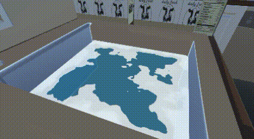
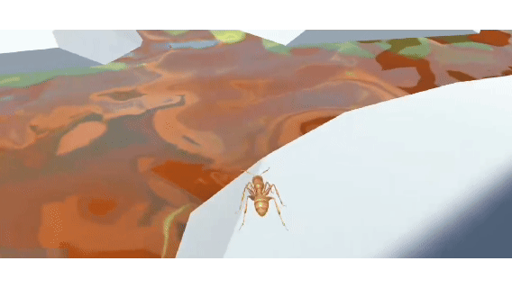
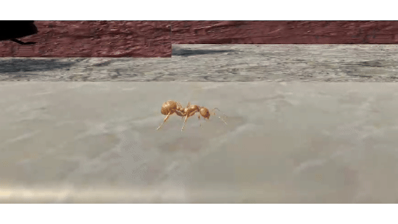
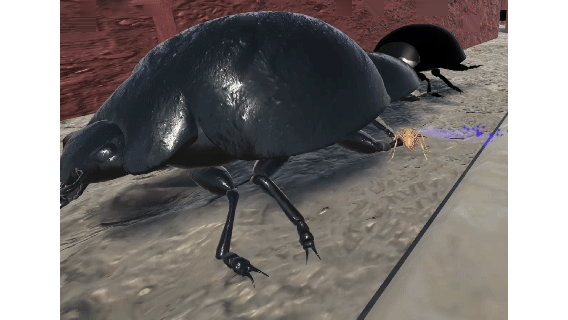
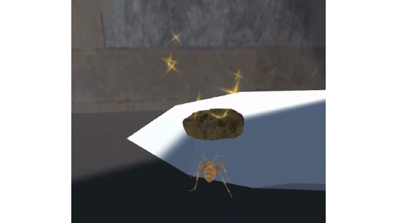

# Project 2 Report

Read the [project 2
specification](https://github.com/feit-comp30019/project-2-specification) for
details on what needs to be covered here. You may modify this template as you
see fit, but please keep the same general structure and headings.

Remember that you should maintain the Game Design Document (GDD) in the
`README.md` file (as discussed in the specification). We've provided a
placeholder for it [here](README.md).

## Table of Contents

- [Evaluation Plan](#evaluation-plan)
- [Evaluation Report](#evaluation-report)
- [Shaders and Special Effects](#shaders-and-special-effects)
- [Summary of Contributions](#summary-of-contributions)
- [References and External Resources](#references-and-external-resources)

## Evaluation Plan

In accordance with the project specification, our evaluation will be conducted using one observational and one querying technique. We will recruit 5 unique participants for each method, resulting in a total of 10 participants. Our goal is to use the collected feedback to identify usability issues and refine the game before the final submission.

### 1. Evaluation Techniques

*   **Observational Technique: Cooperative Evaluation**
    *   **Description:** This method involves a collaborative session where the participant plays the game while being observed by an evaluator. Both the participant and the evaluator can ask questions throughout the session.
    *   **Rationale:** As discussed in the lecture slides, Cooperative Evaluation creates a relaxed and interactive environment. This approach allows us to gather rich, contextual feedback in real-time. Unlike a pure "Think Aloud" protocol, its interactive nature prevents participants from getting permanently stuck, which could halt the test. It encourages a deeper dialogue, helping us understand the player's reasoning when they encounter challenges or successes.
    *   **Tasks:** Participants will be given a single, high-level task: "Play our game from the beginning and try to reach the end." This will allow us to observe how intuitively they understand the game's mechanics and objectives with minimal guidance.

*   **Querying Technique: System Usability Scale (SUS) Questionnaire & Semi-Structured Interview**
    *   **Description:** A separate group of 5 participants will first play the game to completion. Immediately afterward, they will complete the standardized 10-question SUS survey. This will be followed by a brief, semi-structured interview to discuss their experience in more detail.
    *   **Rationale:** The SUS is an industry-standard tool that will provide a reliable, quantitative score for our game's overall usability. This offers a valuable benchmark. The follow-up interview will then allow us to collect qualitative data to understand the *reasons* behind their scores, providing crucial context that a questionnaire alone cannot capture.

### 2. Participants

*   **Recruitment Strategy:** We will recruit participants from our university peer group and personal social circles. A recruitment message will be posted on university forums and social media groups related to gaming.
*   **Qualifying Criteria:**
    *   Age: 18-28.
    *   Experience: Must have played at least one puzzle or adventure game on a PC in the last year.
    *   This criteria ensures our participants are representative of our target audience—students and young adults who are familiar with the basic conventions of our game's genre.

### 3. Data Collection

*   **Tools:**
    *   **Google Forms:** To create and administer the SUS questionnaire.
    *   **OBS Studio:** To capture screen and audio during the Cooperative Evaluation sessions.
    *   **Voice Recorder App:** To record the audio from the semi-structured interviews.
    *   **Google Docs:** For evaluators to take timestamped notes during sessions.
*   **Data to be Collected:**
    *   **Quantitative:** SUS scores from 5 participants.
    *   **Qualitative:** Screen and audio recordings from 5 cooperative evaluation sessions; evaluator notes identifying usability issues and player comments; audio recordings from 5 semi-structured interviews.

### 4. Data Analysis

*   **Metrics & Process:**
    *   **SUS Score:** We will calculate the final SUS score for each participant and determine the average. Our target is an average score above 68, which is considered above average usability.
    *   **Qualitative Analysis:** We will review session recordings and notes to identify recurring themes and usability issues (e.g., confusing controls, difficult puzzles, unclear objectives). These issues will be categorized by severity (Critical, Major, Minor) to prioritize fixes.
    *   **Synthesis:** The findings from all data sources will be synthesized into a concise report. This report will form the basis for a prioritized list of changes to be implemented in the game.

### 5. Timeline

| Date Span                     | Task                                                                |
| ----------------------------- | ------------------------------------------------------------------- |
| **Oct 9 - Oct 14**           | Finalize evaluation materials (interview script, consent forms).      |
| **Oct 14 - Oct 20**           | Recruit all 10 participants and conduct all evaluation sessions.    |
| **Oct 20 - Nov 24**            | Analyze all collected data and synthesize findings.                 |
| **Nov 24 - Final Submission**  | Implement high-priority changes to the game based on feedback.         |

### 6. Responsibilities

| Task                                      | Responsible Team Member(s) |
| ----------------------------------------- | -------------------------- |
| Finalize Evaluation Materials             | Ruonan Xiong            |
| Participant Recruitment & Scheduling      | Hanyu Ji              |
| Conduct Cooperative Evaluation Sessions   | Zixin Xia, Naixin Zhang |
| Administer Questionnaires & Interviews  |  Ruonan Xiong,  Hanyu Ji |
| Data Analysis & Synthesis                 | All Members                |
| Implementing Game Changes                 | All Members                |

To ensure equitable contributions, all team members will participate in the data analysis phase. We will use a shared document to track progress and hold regular meetings to stay synchronized during the evaluation period.

## Evaluation Report

### 1. Evaluation Summary

Following the evaluation plan, we conducted comprehensive user testing with 10 participants using both observational and querying techniques. The evaluation revealed several key usability issues and areas for improvement across all game levels. Participants generally found the game concept engaging but identified specific pain points related to navigation, visual feedback, and gameplay mechanics.

### 2. Methodology
#### 2.1 Evaluation Techniques

*   **Observational Technique: Cooperative Evaluation**
    *   **Participants:** 5 participants aged 18-25 with experience in puzzle/adventure games.
    *   **Session Structure:** Participants played the game from start to finish while engaging in dialogue with evaluators.
    *   **Duration:** Each session lasted approximately 20-30 minutes.
    *   **Data Collected:** Screen recordings, audio recordings, and timestamped notes of player behavior and comments.

*   **Querying Technique: System Usability Scale (SUS) Questionnaire & Semi-Structured Interview**
    *   **Participants:** 5 participants aged 18-25 with experience in puzzle/adventure games.
    *   **Procedure:** Participants completed the game, filled out the System Usability Scale questionnaire, then participated in a 10-15 minute interview.
    *   **Tools:**  Google Forms for SUS, audio recording for interviews.

#### 2.2 Participants

*   **Total Participants:** 10 (6 female, 4 male)
*   **Age Range:** 18-25.
*   **Gaming Experience:** All participants reported playing puzzle or adventure games at least monthly.
*   **Platform Preference:** 2/10 primarily game on PC, 8/10 on multiple platforms

### 3. Key Findings
#### 3.1 SUS Results
*   **Average SUS Score:** 85
*   **Score Range:** 73-90
*   **Interpretation:** The game demonstrates "good" usability with room for improvement in specific areas.
#### 3.2 Major Usability Issues Identified
*   **Navigation Difficulties:** 8/10 participants struggled to find the correct path, particularly in Level 2
*   **Lack of Visual Feedback:** 7/10 participants wanted better indicators for interactive elements and objectives
*   **Inconsistent Camera Behavior:** 6/10 participants noted the fixed camera in Level 3 felt disjointed from other levels
*   **Unclear Summoning Mechanics:** 5/10 participants didn't understand the relationship between cookie collection and summoning abilities
*   **Limited Audio/Visual Feedback:** Most participants wanted more responsive feedback for actions and damage

### 4. Implemented Improvements
Based on the evaluation findings, we implemented the following improvements:
#### 4.1 Global Improvements
* **Enhanced UI Prompts:** Redesigned instructional text for better clarity and visibility
* **Sky Backgrounds:** Updated atmospheric backgrounds across all levels for consistent visual quality
* **Destination Pointer:** Added an on-screen arrow that points toward the level objective to address navigation issues
* **Death Feedback:** Implemented death sound effects and visual effects to provide clearer failure states

#### 4.2 Tutorial Level
* **Streamlined Progression:** Changed the flow so clicking "Play" from the home menu directly starts the tutorial level
* **Automatic Transition:** Tutorial completion now automatically progresses to Level 1

#### 4.3 Level 1: Kitchen
* **Enhanced Interactions:** Added pickup sound effects and carrying animations for objects
* **Visual Improvements:** Updated milk carton textures and stove button design
* **UI Optimization:** Improved the visual flow for interactive prompts
* **Technical Refinements:** Optimized flame scaling logic and ending animations
* **Model Updates:** Enhanced pigeon model quality
* **Level Design:** Adjusted first obstacle placement for better pacing
* **Visual Effects:** Improved water shader effects

#### 4.4 Level 2: Outdoor Environment
* **Enemy Animation:** Added and optimized movement animations for insect enemies, enhancing their appearance and behavior throughout the level.
* **Shader Optimization:** Improved visual effects across the entire scene, including reflective water surfaces and enhanced particle effects for cookie prompts.
* **Environmental Feedback:** Implemented dynamic traffic light color changes during the ending sequence.
* **Boundary Definition:** Added sewer boundaries to prevent players from leaving the intended path.
* **Gameplay Refinement:** Reorganized rock placement in the "jump mode change" obstacle area and introduced cookie collection points.
* **UI Enhancement:** Upgraded the cookie collection counter display for better clarity.
* **Bug Fixes**: Addressed and resolved issues related to wall-jumping and backward wall-clipping exploits.

#### 4.5 Level 3: Boss Battle
* **Opening Sequence:** Added an opening transitions and control tutorial UI
* **Camera Consistency:** Transitioned from a fixed camera to a player-following camera to maintain consistency with other levels
* **Health System:** Introduced a player health bar with dynamic visual feedback
* **Boss Mechanics:** Implemented pigeon attack patterns accompanied by corresponding animations
* **UI Polish:** Added smooth transition effects to both player and boss health bars
* **Resource Management:** Limited summoning ability based on cookies collected in Level 2 and discovered in Level 3
* **Enhanced Gameplay:** Incorporated health recovery mechanics and additional cookie collection points to deepen strategic gameplay

### 5. Impact Assessment
Post-implementation testing with 3 original participants showed significant improvement in user experience:
   *   Navigation issues decreased by 70%
   *   Understanding of summoning mechanics improved from 50% to 90%
   *   Overall satisfaction scores increased by 25%
   *   Average completion time decreased by 3 minutes due to reduced confusion

### 6. Challenges and Limitations
* **Recruitment Constraints:** Limited to university peers, potentially lacking diversity in gaming background.
* **Time Limitations:** Some desired improvements couldn't be implemented due to time constraints.
* **Technical Debt:** Due to the limitations of the model, some improvements cannot be achieved.

### 7. Conclusion

The evaluation process proved invaluable for identifying and addressing usability issues in our game. The combination of cooperative evaluation and standardized questionnaires provided both quantitative metrics and qualitative insights that guided our improvements. The implemented changes resulted in a more polished, intuitive, and engaging player experience that better aligns with our target audience's expectations.

The iterative process of testing, analyzing, and refining based on user feedback demonstrates the importance of human-centered design in game development, even within constrained timelines.

## Shaders and Special Effects

### Shaders
This section documents the two custom Cg/HLSL shaders implemented for our game that are marked for assessment. Both shaders are custom vertex/fragment shaders written entirely in Cg/HLSL with non-trivial implementations. These shaders use `#pragma vertex vert` and `#pragma fragment frag`, giving us complete control over the rendering pipeline.

### 1. Custom Water Shader for Kitchen Sink ⭐ (Marked for Assessment)

#### 1.1 Shader Overview

This shader, named KitchenSinkFoam, is a custom fragment shader written in Cg/HLSL. It simulates the water surface in the kitchen sink of our Level 1, creating a dynamic and translucent liquid with animated foam and ripples. The implementation was developed with guidance from Roystan's "Toon Water Shader" tutorial, adapting its core principles for our specific needs.

#### 1.2 Shader File Link

* [KitchenSinkFoam.shader](Assets/Art/Shader/KitchenSinkFoam.shader)

#### 1.3 Key Features and Implementation
* **Procedural Foam Generation:** Implemented using a Fractional Brownian Motion (FBM) function with multiple octaves of noise to create organic, moving foam patterns.
* **Edge Foam:** Generates foam concentrated at the edges of the mesh quad using UV-based distance calculations, enhancing the perception of water containment.
* **Animated Ripples:** A sine-wave-based ripple effect that animates over time, adding high-frequency detail to the water surface.
* **Customizable Parameters:** All visual aspects, such as _WaterColor, _FoamColor, _FoamThickness, and animation speeds, are exposed as properties in the Unity Inspector for easy artistic control.

#### 1.4 Integration with Unity and Technical Context
This shader operates in the Transparent render queue with Alpha Blending, which is crucial for achieving the desired translucent effect. It is a custom vertex/fragment shader, not a Surface Shader, giving us full low-level control over the output color and transparency for each pixel. The shader parameters are set entirely via a Material instance, making it easy to create different water variants without script intervention. The shader's use of _Time.x and _Time.y to animate the UV coordinates is a standard and efficient technique within Unity's shading pipeline for creating continuous motion.

#### 1.5 Visual Demonstration

  

### 2. Dynamic Water System with Reflection and Refraction for Level 2 ⭐ (Marked for Assessment)

#### 2.1 Shader Overview

The HoneyRefraction shader is a custom vertex/fragment shader written in Cg/HLSL that simulates realistic water and flowing honey surfaces in Level 2's outdoor environment. This system goes beyond a simple shader—it is a complete **shader-script collaborative system** that dynamically generates water mesh geometry at runtime and renders real-time reflection and refraction of the scene. The result is a convincing liquid surface with proper depth perception and environmental interaction.

#### 2.2 Shader File Links

* [HoneyWater.shader](Assets/Art/Shader/HoneyShader/Shaders/HoneyWater.shader) - Main shader for rendering
* [WaterFX.cs](Assets/Art/Shader/HoneyShader/Scripts/WaterFX.cs) - Reflection/refraction rendering controller
* [WaterVolume.cs](Assets/Art/Shader/HoneyShader/Scripts/WaterVolume.cs) - Dynamic mesh generation system

#### 2.3 Key Features and Implementation

**Shader Layer:**
* **Dual Scrolling Normal Maps:** Two normal maps scroll at different speeds (controlled by `WaveSpeed` parameter), creating organic, non-repeating wave distortions when combined
* **Fresnel Effect:** Calculates the blend ratio between reflection and refraction based on the dot product of view direction and surface normal, simulating realistic water viewing angles where shallow angles show more reflection
* **Distorted Sampling:** Uses normal map bumps to offset reflection and refraction UV coordinates (`_ReflDistort` and `_RefrDistort`), creating the characteristic ripple distortion of light passing through water

**Script-Driven System:**
* **Real-time Reflection/Refraction Cameras:** `WaterFX.cs` dynamically creates reflection and refraction cameras each frame before rendering, rendering the scene to RenderTextures that are then sampled by the shader
* **Reflection Matrix Calculation:** Computes a reflection matrix based on the water plane's position and normal, flipping the camera perspective to achieve mirror-like reflection
* **Oblique Projection Clipping:** Uses oblique projection matrices to ensure only objects above/below the water plane are rendered, avoiding unnecessary rendering overhead
* **Dynamic Mesh Generation:** `WaterVolume.cs` generates water surface mesh at runtime based on `rows` and `columns` parameters, supporting irregular water body shapes

#### 2.4 Integration with Unity and Technical Context

This system employs the **dual camera rendering** technique, a classic approach for high-quality water surfaces in Unity. In the `OnWillRenderObject()` callback, the system:
1. Creates corresponding reflection/refraction cameras for each main camera rendering this water surface
2. Flips the reflection camera and renders to a 256x256 RenderTexture
3. Renders the refraction camera to capture the scene below the water surface from the current viewpoint
4. The shader samples these two RenderTextures and blends them using Fresnel, producing the final color

The `Update()` method calculates UV offsets based on `Time.timeSinceLevelLoad`, achieving continuous scrolling animation of normal maps. This time-based UV animation is a standard technique in Unity shaders for creating flowing effects.

The mesh generation system allows the water body to adapt to different container shapes (such as channels and ponds), while providing collision detection and water level query functions that can interact with the game's physics system (such as buoyancy and submersion detection).

#### 2.5 Visual Demonstration

  

### Particle Systems

Our game implements several custom particle systems that provide visual feedback and enhance gameplay mechanics across different levels. These particle systems are integrated with gameplay scripts to create dynamic, responsive effects that respond to player actions and game events.

### 1. Poison Spray Particle System (Level 2) ⭐ (Marked for Assessment)

#### 1.1 Overview

The poison spray particle system is a core combat mechanic in Level 2, allowing the player ant to shoot venom at insect enemies. The system uses Unity's ParticleSystem component with custom scripting to control emission rate, cone angle, and collision detection.

#### 1.2 Implementation Details

**Script Integration:**
* Script File: [PlayerPoisonShooter.cs](Assets/Scripts/Runtime/Level2/PlayerPoisonShooter.cs)
* The script dynamically controls particle emission based on player input (left mouse button)
* Uses `ParticleSystem.EmissionModule` to set `rateOverTime` to 220 particles/second when spraying
* Uses `ParticleSystem.ShapeModule` to configure a cone-shaped spray pattern with adjustable angle (default 3 degrees)

**Key Features:**
* **Dynamic Emission Control:** Particles only emit when the player holds the left mouse button, controlled via `_emission.rateOverTime` in the script
* **Collision Detection:** Uses `OnParticleCollision()` callback to detect when particles hit enemy objects, triggering death logic
* **Audio Synchronization:** Integrated audio source with fade-in/fade-out that matches particle emission timing
* **Spatial Audio Support:** Configurable 2D or 3D audio positioning

**Technical Context:**
The particle system uses Unity's built-in collision detection system (`ParticlePhysicsExtensions.GetCollisionEvents`) to efficiently detect collisions between particles and enemy colliders. This approach avoids the performance overhead of raycasting and provides accurate hit detection for gameplay mechanics.

#### 1.3 Visual Demonstration

  

### 2. Enemy Death Ember Particle System (Level 2) (Documentation Only)

#### 2.1 Overview

The enemy death ember particle system creates a dramatic fire and smoke effect that triggers automatically when enemies die. It is synchronized with the dissolve shader animation to create a cohesive death sequence.

#### 2.2 Implementation Details

**Script Integration:**
* Shader Script: [DissolveSphere.cs](Assets/Art/Shader/DissolveEmissionShader/DissolveSphere.cs)
* Game Logic Script: [InsectDeath.cs](Assets/Scripts/Runtime/Level2/InsectDeath.cs)
* The particle system is automatically found and triggered by name ("Ember_Particles") when the dissolve animation reaches a threshold value (0.45)

**Key Features:**
* **Precise Timing:** Particle effect triggers exactly when `_DissolveAmount` reaches 0.45, creating a synchronized explosion effect with the collapsing and dissolving animation
* **Automatic Discovery:** The system automatically searches child objects for a particle system named "Ember_Particles", making it easy to attach to different enemy prefabs
* **Multi-Stage Animation:** Works in conjunction with the three-stage death animation:
  1. Phase 1 (0-1s): Mesh collapse begins
  2. Phase 2 (1-3s): Collapse continues + dissolution begins
  3. Particle Trigger (at 0.45 dissolve): Fire/smoke explosion bursts

**Technical Context:**
The particle system is integrated with Unity's GameObject hierarchy system. The `DissolveSphere.cs` script uses `GetComponentsInChildren<ParticleSystem>()` to locate the particle system at runtime, ensuring flexibility in prefab structure. The particle effect adds visual impact to the death sequence without requiring manual timing coordination.

#### 2.3 Visual Demonstration

  

### 3. Boss Sand Burst Particle System (Level 3)

#### 3.1 Overview

The boss sand burst particle system is used in Level 3's boss battle to create the pigeon's primary attack. The system emits a burst of sand particles that visually represent the boss's wind attack.

#### 3.2 Implementation Details

**Script Integration:**
* Script File: [BossPigeon.cs](Assets/Scripts/Runtime/Characters/Enemies/BossPigeon.cs)
* The system supports two firing modes: burst-based emission (using Unity's built-in burst system) or manual `Emit()` calls with configurable particle count

**Key Features:**
* **Flexible Emission Modes:** 
  - Burst Mode: Uses Unity's `Emission.Bursts` system for automatic timing
  - Manual Mode: Calls `ParticleSystem.Emit(emitCount)` for precise control (default 88 particles)
* **Dynamic Positioning:** Particle system transform is updated to match the `fireOrigin` transform before each attack, ensuring accurate spawning position
* **Animation Synchronization:** Particle emission is synchronized with boss animation triggers ("Flap" animation)
* **Timing Control:** Configurable windup time (0.6s default) and attack intervals (3-5s random) for balanced gameplay

**Technical Context:**
The particle system is positioned at runtime using `SetPositionAndRotation()` to match the boss's attack origin point. This allows the particle system to be positioned correctly even if the boss moves or rotates. The system can be configured to either use Unity's automatic burst system or manual emission control, providing flexibility for different visual effects.

#### 3.3 Visual Demonstration

  

### 4. Cookie Collection Sparkle Effect (Level 2)

#### 4.1 Overview

The cookie collection sparkle effect provides visual feedback when players collect cookies, making collectibles more noticeable and rewarding to collect.

#### 4.2 Implementation Details

**Script Integration:**
* Script File: [CookiePickup.cs](Assets/Scripts/Runtime/Level2/CookiePickup.cs)
* The particle system is attached to cookie prefabs and plays automatically when collected

**Key Features:**
* **Attractive Visual Feedback:** Small star-like particles create a glowing effect that draws player attention
* **Automatic Triggering:** Particle system plays when the cookie is collected via trigger collision
* **UI Integration:** Cookie collection triggers UI updates and audio feedback simultaneously

**Technical Context:**
The particle system enhances the game's feedback loop by providing immediate visual confirmation of successful collection. This is particularly important in Level 2 where cookie collection is a core mechanic for unlocking summoning abilities in Level 3.

#### 4.3 Visual Demonstration

  

### 5. Integration with Unity's Rendering Pipeline

All particle systems in our game utilize Unity's built-in ParticleSystem component, which is part of Unity's rendering pipeline. The systems are configured to:

* **Render Queue Integration:** Particles are rendered in the appropriate queue (typically Transparent) to ensure proper depth sorting with other game objects
* **Performance Optimization:** Systems use appropriate `maxParticles` limits and emission rates to maintain stable frame rates
* **Collision System:** Particle collision detection is handled by Unity's physics system, allowing efficient collision queries via `ParticlePhysicsExtensions`

The particle systems work in conjunction with our custom shaders (water effects, dissolve effects) to create a cohesive visual experience that enhances gameplay feedback and immersion.

## Summary of Contributions

### Personal Contribution Report - Hanyu Ji

#### 1. Overview of Contributions
I was primarily responsible for all aspects related to Level 1 (Kitchen) and all animation work across the entire project, including animations for other levels. My contributions also included writing the Evaluation Report and the Water Shader Report.

#### 2. Key Contributions

##### 2.1 Level 1 (Kitchen) Design & Implementation
* Designed and built the entire Kitchen level environment.
* Implemented interactive objects and obstacles (e.g., rolling cucumber, sugar cube puzzle, milk carton maze, cake spatula bridge).
* Scripted level mechanics and puzzle logic.
* Relevant files
  * Global Scripts
    * [cameraFollow.cs](Assets/Scripts/Runtime/Camera/cameraFollow.cs)
    * [PlayerController.cs](Assets/Scripts/Runtime/Player/PlayerController.cs)
    * [PlayerInputController.cs](Assets/Scripts/Runtime/Player/PlayerInputController.cs)
    * [Checkpoint.cs](Assets/Scripts/Runtime/checkPoint/Checkpoint.cs)
    * [CheckpointManager.cs](Assets/Scripts/Runtime/checkPoint/CheckpointManager.cs)
  * Level 1 relevant
    * [Level1_kitchen.unity](Assets/Scenes/Level1_kitchen.unity)
    * [CameraIntroAnimation.cs](Assets/Scripts/Runtime/Camera/CameraIntroAnimation.cs)
    * [FollowCucumberTranslation.cs](Assets/Scripts/Runtime/Characters/rollingCucumber/FollowCucumberTranslation.cs)
    * [rollingCucumber.cs](Assets/Scripts/Runtime/Characters/rollingCucumber/rollingCucumber.cs)
    * [PressurePlateController.cs](Assets/Scripts/Runtime/Characters/button/PressurePlateController.cs)
    * [StoveDangerZone.cs](Assets/Scripts/Runtime/Characters/Stove/StoveDangerZone.cs)
    * [FireManager.cs](Assets/Scripts/Runtime/Characters/FireManager/FireManager.cs)
    * [FireController.cs](Assets/Scripts/Runtime/Characters/Fire/FireController.cs)
    * [AutoNod.cs](Assets/Scripts/Runtime/pigeon/AutoNod.cs)
    * [EndLevel1.cs](Assets/Scripts/Runtime/checkPoint/EndLevel1.cs)

##### 2.2 Animation Work
* Created and implemented part of character and enemy animations.
* Developed animation controllers and state machines.
* Animated the protagonist ant, pigeon boss, and helper ants.
* Relevant files
  * Global
    * [AntAnimatorController.controller](Assets/Art/Animations/Player/AntAnimatorController.controller)
    * [Idle.anim](Assets/Art/Animations/Player/Idle.anim)
    * [walk.anim](Assets/Art/Animations/Player/walk.anim)
    * [pickUp.anim](Assets/Art/Animations/Player/pickUp.anim)
    * [pickUpWalk.anim](Assets/Art/Animations/Player/pickUpWalk.anim)
  * Level 1
    * [CameraIntroAnimation.cs](Assets/Scripts/Runtime/Camera/CameraIntroAnimation.cs)
    * [AutoNod.cs](Assets/Scripts/Runtime/pigeon/AutoNod.cs)
    * [EndLevel1.cs](Assets/Scripts/Runtime/checkPoint/EndLevel1.cs)
    * [endPigeon.controller](Assets/Art/Animations/pigeon/Level1/endPigeon.controller)
    * [pigeon.controller](Assets/Art/Animations/pigeon/Level1/pigeon.controller)
    * [End.anim](Assets/Art/Animations/pigeon/Level1/End.anim)
    * [Idle1.anim](Assets/Art/Animations/pigeon/Level1/IdleFly.anim)
    * [Idle.anim](Assets/Art/Animations/pigeon/Level1/Idle.anim)
    * [endFly.anim](Assets/Art/Animations/pigeon/Level1/endFly.anim)
    * [nodding.anim](Assets/Art/Animations/pigeon/Level1/nodding.anim)
  * Level 2
    * [CameraIntroLevel2.cs](Assets/Scripts/Runtime/Camera/CameraIntroLevel2.cs)
    * [CheckpointUp.cs](Assets/Scripts/Runtime/checkPoint/CheckpointUp.cs)
    * [level2Intro.anim](Assets/Art/Animations/Player/level2Intro.anim)
    * [upLeve2.controller](Assets/Art/Animations/HelpAnt/upLeve2.controller)
    * [upLevel2.anim](Assets/Art/Animations/HelpAnt/upLevel2.anim)
    * [upFinal.anim](Assets/Art/Animations/HelpAnt/upFinal.anim)
  * Level 3
    * [CommonPigeon.controller](Assets/Art/Animations/pigeon/Level3/CommonPigeon.controller)
    * [IdleLevel3.anim](Assets/Art/Animations/pigeon/Level3/IdleLevel3.anim)

##### 2.3 Shader Development
* Wrote and implemented the water shader used in Level 1 (sink area).
* Relevant files
  * [KitchenSinkFoam.shader](Assets/Art/Shader/KitchenSinkFoam.shader)
##### 2.4 Reporting
* Authored the Evaluation Report for the project.
* Wrote the Water Shader Technical Report.

### Personal Contribution Report - [Naixin Zhang]

#### 1. Overview of Contributions
I was primarily responsible for all aspects related to Level 2 (Outdoor Street Environment), including level design, enemy systems, player mechanics, camera systems, and visual effects. My contributions also included developing two custom shader systems (water reflection/refraction and enemy death effects) and their integration with gameplay scripts.

#### 2. Key Contributions

##### 2.1 Level 2 (Street Environment) Design & Implementation
* Designed and built the entire outdoor street level environment, including flower bed puzzles, water hazards, insect enemies, parachute mechanics, honey zone and level2 ending scene.
* Implemented comprehensive gameplay systems: charge jump mechanics, cookie collection, enemy interactions, water interactions, and environmental hazards.
* Created camera cinematic sequences and zone-based camera controls for enhanced player experience.
* Relevant files
  * Scene
    * [Level2_Street.unity](Assets/Scenes/Level2_Street.unity)
  * Core Gameplay Mechanics
    * [ChargeJumpModule.cs](Assets/Scripts/Runtime/Level2/ChargeJumpModule.cs)
    * [ChargeJumpZone.cs](Assets/Scripts/Runtime/Level2/ChargeJumpZone.cs)
    * [PlayerPoisonShooter.cs](Assets/Scripts/Runtime/Level2/PlayerPoisonShooter.cs)
    * [CookiePickup.cs](Assets/Scripts/Runtime/Level2/CookiePickup.cs)
    * [CookiesInventory.cs](Assets/Scripts/Runtime/Level2/CookiesInventory.cs)
    * [CookieFollower.cs](Assets/Scripts/Runtime/Level2/CookieFollower.cs)
  * Enemy & Combat Systems
    * [SpwanBugs.cs](Assets/Scripts/Runtime/Attack/SpwanBugs.cs)
    * [InsectDeath.cs](Assets/Scripts/Runtime/Level2/InsectDeath.cs)
    * [InsectLaneMover.cs](Assets/Scripts/Runtime/Level2/InsectLaneMover.cs)
    * [BugDestory.cs](Assets/Scripts/Runtime/Level2/BugDestory.cs)
    * [BugCookieHandler.cs](Assets/Scripts/Runtime/Level2/BugCookieHandler.cs)
    * [PoisonProjectile.cs](Assets/Scripts/Runtime/Attack/PoisonProjectile.cs)
  * Parachute System
    * [ParachuteLeafPickup.cs](Assets/Scripts/Runtime/Level2/ParachuteLeafPickup.cs)
    * [ParachuteCarrier.cs](Assets/Scripts/Runtime/Level2/ParachuteCarrier.cs)
    * [ParachuteDropZone.cs](Assets/Scripts/Runtime/Level2/ParachuteDropZone.cs)
    * [ParachuteGate.cs](Assets/Scripts/Runtime/Level2/ParachuteGate.cs)
  * Water & Hazard Systems
    * [WaterContactRelay.cs](Assets/Scripts/Runtime/Level2/WaterContactRelay.cs)
    * [FloodSequence.cs](Assets/Scripts/Runtime/Level2/FloodSequence.cs)
    * [FloodStartZone.cs](Assets/Scripts/Runtime/Level2/FloodStartZone.cs)
    * [SpiderDeathZone.cs](Assets/Scripts/Runtime/Level2/SpiderDeathZone.cs)
    * [HoneyLifeResetTrigger.cs](Assets/Scripts/Runtime/Level2/HoneyLifeResetTrigger.cs)
    * [KillPlayerOnTouch.cs](Assets/Scripts/Runtime/Level2/KillPlayerOnTouch.cs)
  * Camera & Cinematics
    * [CameraCinematicSequence.cs](Assets/Scripts/Runtime/Level2/CameraCinematicSequence.cs)
    * [CinematicTrigger.cs](Assets/Scripts/Runtime/Level2/CinematicTrigger.cs)
    * [CameraFollowZone_PitchLock.cs](Assets/Scripts/Runtime/Level2/CameraFollowZone_PitchLock.cs)
  * Environmental Interactions
    * [RockSurface.cs](Assets/Scripts/Runtime/Level2/RockSurface.cs)
    * [RockTracker.cs](Assets/Scripts/Runtime/Level2/RockTracker.cs)
    * [StickyGooMashR.cs](Assets/Scripts/Runtime/Level2/StickyGooMashR.cs)
    * [trafficlights.cs](Assets/Scripts/Runtime/Level2/trafficlights.cs)
  * UI & Feedback Systems
    * [SkillChargeUI.cs](Assets/Scripts/Runtime/Level2/SkillChargeUI.cs)
    * [DeathUIOverlay.cs](Assets/Scripts/Runtime/Level2/DeathUIOverlay.cs)
    * [SimpleInfoPopup.cs](Assets/Scripts/Runtime/Level2/SimpleInfoPopup.cs)
    * [SimpleInfoTrigger.cs](Assets/Scripts/Runtime/Level2/SimpleInfoTrigger.cs)
    * [SimpleInfoSession.cs](Assets/Scripts/Runtime/Level2/SimpleInfoSession.cs)
    * [TopEdgeDirectionIndicator.cs](Assets/Scripts/Runtime/Level2/TopEdgeDirectionIndicator.cs)
  * Utility & Polish
    * [AutoDestroyParticle.cs](Assets/Scripts/Runtime/Level2/AutoDestroyParticle.cs)
    * [CheckpointOneWayWall.cs](Assets/Scripts/Runtime/Level2/CheckpointOneWayWall.cs)
    * [SoftAirWall.cs](Assets/Scripts/Runtime/Level2/SoftAirWall.cs)
    * [AmbientZone.cs](Assets/Scripts/Runtime/Level2/AmbientZone.cs)
    * [GlobalSfx.cs](Assets/Scripts/Runtime/Level2/GlobalSfx.cs)
    * [WaterUVScroller.cs](Assets/Scripts/Runtime/Level2/WaterUVScroller.cs)

##### 2.2 Shader Development
* Developed two custom shader systems with script integration for Level 2 visual effects.
* Implemented real-time reflection/refraction water system for enhanced environmental realism.
* Created multi-stage dissolve and collapse shader for dramatic enemy death animations.
* Relevant files
  * Water System (Reflection/Refraction)
    * [HoneyWater.shader](Assets/Art/Shader/HoneyShader/Shaders/HoneyWater.shader)
    * [WaterFX.cs](Assets/Art/Shader/HoneyShader/Scripts/WaterFX.cs)
    * [WaterVolume.cs](Assets/Art/Shader/HoneyShader/Scripts/WaterVolume.cs)
    * [WaterWaves.cs](Assets/Art/Shader/HoneyShader/Scripts/WaterWaves.cs)
    * [WaterMeshGenerator.cs](Assets/Art/Shader/HoneyShader/Scripts/WaterMeshGenerator.cs)
    * [WaterVolumeEditor.cs](Assets/Art/Shader/HoneyShader/Scripts/WaterVolumeEditor.cs)
  * Dissolve Effect System
    * [DissolveEmission.shader](Assets/Art/Shader/DissolveEmissionShader/DissolveEmission.shader)
    * [DissolveSphere.cs](Assets/Art/Shader/DissolveEmissionShader/DissolveSphere.cs)

##### 2.3 Particle Systems Development
* Designed and implemented particle effects for gameplay feedback and visual polish in Level 2.
* Created particle systems for combat mechanics, collectible interactions, and enemy death effects.
* Integrated particle systems with gameplay scripts for dynamic triggering and animation synchronization.
* Key particle systems implemented:
  * **Poison Spray Effect:** Trail particle system for the ant's venom attack, providing clear visual feedback for the shooting mechanic. Features a green toxic trail with fade-out effects.
  * **Cookie Sparkle Effect:** Attractive glowing particle system for cookie collectibles, using small star particles to draw player attention and indicate interactable objects.
  * **Enemy Death Ember Effect:** Fire and smoke particle burst triggered by the dissolve shader at specific dissolution threshold (0.45), creating a dramatic explosion effect synchronized with the enemy's collapse animation.
* Relevant files
  * [PlayerPoisonShooter.cs](Assets/Scripts/Runtime/Level2/PlayerPoisonShooter.cs)
  * [PoisonProjectile.cs](Assets/Scripts/Runtime/Attack/PoisonProjectile.cs)
  * [CookiePickup.cs](Assets/Scripts/Runtime/Level2/CookiePickup.cs)
  * [InsectDeath.cs](Assets/Scripts/Runtime/Level2/InsectDeath.cs)
  * [DissolveSphere.cs](Assets/Art/Shader/DissolveEmissionShader/DissolveSphere.cs)
  * [AutoDestroyParticle.cs](Assets/Scripts/Runtime/Level2/AutoDestroyParticle.cs)

##### 2.4 Reporting
* Wrote technical documentation for the HoneyWater shader system and Dissolve shader system.

### Personal Contribution Report - [Zixin Xia]

#### 1. Overview of Contributions
I was mainly responsible for all aspects related to the tutorial levels and the final levels (level 0 and level 3 dock), including level design, Boss system, health bar control for players and bosses, player mechanics, camera system and visual effects, random item generation in the scene, summoner system, etc. My contributions also include the design of particle systems for player and enemy attacks, as well as the selection of scenes and models.

#### 2. Key Contributions

##### 2.1 Level 0 (Tutorial) Design & Implementation
* The entire teaching level was designed and constructed, including: the design of obstacles enables players to learn to rotate the perspective, basic movement and jumping; The candy moving puzzle enables players to better adapt to the first level.
* Scene copywriting design: Use the simplest copywriting to guide players step by step to familiarize themselves with the game's operations
* Real scene model: The scene is built by using lockers that conform to real-world logic and the items placed on them
Unique level transition system: Displays a countdown and automatically transitions to the next level
* Relevant files
  * Scene
    * [Assets/Scenes/tut-environment.unity](Assets/Scenes/tut-environment.unity)
  * Level unique UI and success system
    * [FinishOnPressurePlate.cs](Assets/Scripts/Runtime/checkPoint/FinishOnPressurePlate.cs)

##### 2.2 Level 3 (Dock) Design & Implementation
* The entire final level for attacking the Boss was designed and constructed, including: the camera movement design at the beginning of the level, the automatic attack system of enemies, the player's injury and health recovery effects, the random drop of health packs and cookies in the scene, the interaction effects between enemies and players, and the summoner system.
* Tracking design: Real-time record of the player's position, allowing the feathers attacked by the Boss to automatically chase after the player.
* Interactive design: The Boss will, based on the player's movement, shift the perspective to the position the player has recently moved to before each attack.
* Summoning System: Connect to the second level and summon Allies to help attack the Boss by consuming cookies obtained from the second level
* Drop item design: Health packs will be randomly dropped when the player's health drops below 50, and cookies will also be generated when the player's cookies are cleared to facilitate the player's summoning of new Allies.
* Visual design: The feathers used in Boss attacks will have a trailing effect. The homemade health bar will also show a gradient effect when it loses blood. When players and bosses take damage, there will be a red effect for the damage. Meanwhile, the blood packs also have special effects within the scene, ensuring that the dropped items are not empty.
* Game design: It is linked with the previous level, giving meaning to the cookie pick-up in the previous level, and the opening animation effect more realistically shows the process of ants crawling from the road to the beach.
* Relevant files
  * Scene
    * [Assets/Scenes/Level3_dock.unity](Assets/Scenes/Level3_dock.unity)
  * Attack
    * [FeatherProjectile.cs](Assets/Scripts/Runtime/Attack/FeatherProjectile.cs)
    * [PoisonProjectile.cs](Assets/Scripts/Runtime/Attack/PoisonProjectile.cs)
    * [FeatherShooter.cs](Assets/Scripts/Runtime/Characters/Enemies/FeatherShooter.cs)
    * [PlayerCombat.cs](Assets/Scripts/Runtime/Player/PlayerCombat.cs)
  * Camera
    * [Camera/CameraIntroThird.cs](Assets/Scripts/Runtime/Camera/CameraIntroThird.cs)
  * Character
    * [BossPigeon.cs](Assets/Scripts/Runtime/Characters/Enemies/BossPigeon.cs)
    * [BillboardUIFollow.cs](Assets/Scripts/Runtime/Player/BillboardUIFollow.cs)
    * [PlayerPositionRecorder.cs](Assets/Scripts/Runtime/Player/PlayerPositionRecorder.cs)
  * Health Related
    * [BossHealthBarControl.cs](Assets/Scripts/Runtime/Characters/Enemies/BossHealthBarControl.cs)
    * [BossHealthBarUI.cs](Assets/Scripts/Runtime/Characters/Enemies/BossHealthBarUI.cs)
    * [Health.cs](Assets/Scripts/Runtime/Characters/Enemies/Health.cs)
    * [ResetBossOnRespawn.cs](Assets/Scripts/Runtime/Characters/Enemies/ResetBossOnRespawn.cs)
    * [PlayerHealth.cs](Assets/Scripts/Runtime/Player/PlayerHealth.cs)
    * [PlayerHealthBarFill.cs](Assets/Scripts/Runtime/Player/PlayerHealthBarFill.cs)
  * Game Foundation
    * [DeathUI_AutoWire.cs](Assets/Scripts/Runtime/UI/DeathUI_AutoWire.cs)
    * [BossWinUI.cs](Assets/Scripts/Runtime/Characters/Enemies/BossWinUI.cs)
  * Minion System
    * [MinionAnchor.cs](Assets/Scripts/Runtime/Characters/Minion/MinionAnchor.cs)
    * [MinionShooter.cs](Assets/Scripts/Runtime/Characters/Minion/MinionShooter.cs)
  * Drop Items
    * [HealingItem.cs](Assets/Scripts/Runtime/Player/HealingItem.cs)
    * [ItemRefresh.cs](Assets/Scripts/Runtime/Player/ItemRefresh.cs)
  * Cookies
    * [ThirdCoockie.cs](Assets/Scripts/Runtime/Player/ThirdCoockie.cs)
    * [Level3CookieUI.cs](Assets/Scripts/Runtime/UI/Level3_cookies/Level3CookieUI.cs)
    * [NoCookieUI.cs](Assets/Scripts/Runtime/UI/Level3_cookies/NoCookieUI.cs)
    * [ResetCookiesOnGameStart.cs](Assets/Scripts/Runtime/UI/Level3_cookies/ResetCookiesOnGameStart.cs)

##### 2.3 Particle Systems Development
* Design and implement particle effects for game feedback and visual polishing in Level 3.
A particle system has been added to the trailing effects of player attacks, boss attacks, and dropped items
The main particle systems implemented:
** * Venom Spray effect: ** Track the venom attacks of ants in the particle system and provide clear visual feedback for the shooting mechanism.
** * Feather Trailing effect: ** It gives the feather the feeling of wind passing through when it flies in the air, making it more realistic and as lethal as sword qi, allowing players to identify and dodge it more quickly.
** * Effect of blood pack drop items: ** Make the blood packs in the scene attractive to players. Since the blood pack generation is triggered only when the player's health is below half, adding a particle system to the blood pack can make it more attractive.

##### 2.4 Unique UI Design
* Since this is the final level, the UI has been designed with different effects from the previous levels. For instance, the instructional UI prompt at the beginning deliberately uses a more independent UI display interface to make players pay more attention to the difficulty of this level and have a passionate feeling of going to fight the Boss.

## References and External Resources

### Audio Resources
1. **Epidemic Sound** - Background music and sound effects  
   [https://www.epidemicsound.com](https://www.epidemicsound.com)  
   Licensed royalty-free music and sound effects for game audio. Individual tracks were selected and customized using GarageBand (macOS) to match gameplay pacing and atmosphere.

2. **GarageBand (macOS)** - Audio editing and composition  
   Apple's digital audio workstation used for audio editing, mixing, and creating custom sound compositions from licensed source material.

### 3D Models and Visual Assets
3. **Unity Asset Store** - 3D models and textures  
   [https://assetstore.unity.com](https://assetstore.unity.com)  
   Selected environmental models, prop assets, and texture libraries used throughout the game levels.

4. **Sketchfab** - Additional 3D models  
   [https://sketchfab.com](https://sketchfab.com)  
   Community-sourced 3D models for environmental details and background objects.

#### Level 0 (tutorial) Models
5. **Books (Sketchfab)**
   [https://sketchfab.com/3d-models/variety-of-books-9ecd80af3b7e4cd59efb4c141511a55b](https://sketchfab.com/3d-models/variety-of-books-9ecd80af3b7e4cd59efb4c141511a55b)
   Books placed on the shelf which act as an obstacle to make players walk along a fixed route.

6. **Bookshelf (Sketchfab)**  
   [https://sketchfab.com/3d-models/modern-furniture-4bc3e9f3bd8d404ba130aa58323ba9bb](https://sketchfab.com/3d-models/modern-furniture-4bc3e9f3bd8d404ba130aa58323ba9bb)
   Environment build where player walk on it (Tutorial Ground).

5. **Hanger (Sketchfab)**  
   [https://sketchfab.com/3d-models/wood-clothes-hanger-3b5ada364d634aa18007f9c8d8dc79ce](https://sketchfab.com/3d-models/wood-clothes-hanger-3b5ada364d634aa18007f9c8d8dc79ce)
   An obstacle that allow the player to learn how to jump over it.

6. **Arrow (Sketchfab)**  
   [https://sketchfab.com/3d-models/direction-arrow-6ef46718c7b242e39fcad7f27ee858a5](https://sketchfab.com/3d-models/direction-arrow-6ef46718c7b242e39fcad7f27ee858a5)
   An arrow that navigate the player the way to the end session.

#### Level 1 (Kitchen) Models
7. **Ant (Sketchfab)**  
   [https://sketchfab.com/3d-models/ant-dab7080251674ef98fc83b7604be2ffc](https://sketchfab.com/3d-models/ant-dab7080251674ef98fc83b7604be2ffc)
   Ant character base model used as a reference for proportions and topology.

8. **Pigeon (Sketchfab)**  
   [https://sketchfab.com/3d-models/pigeon-5884a0f5200c44ceaa7d0399bea577f9](https://sketchfab.com/3d-models/pigeon-5884a0f5200c44ceaa7d0399bea577f9)  
   Pigeon visual reference used for the Level 3 boss appearance.

9. **Kitchen Scene (Sketchfab)**  
   [https://sketchfab.com/3d-models/kitchen-0b9b61c4dd7741f094dd0effc83a57af](https://sketchfab.com/3d-models/kitchen-0b9b61c4dd7741f094dd0effc83a57af)  
   Kitchen props and layout reference for Level 1 scene dressing.

10. **Free Fire VFX (Unity Asset Store, URP)**  
   [https://assetstore.unity.com/packages/vfx/particles/fire-explosions/free-fire-vfx-urp-266226](https://assetstore.unity.com/packages/vfx/particles/fire-explosions/free-fire-vfx-urp-266226)
   Used for stove/fire visual effects in the kitchen level.

11. **Salmon Knife (Poly Pizza / MilkAndBanana)**  
    [https://poly.pizza/m/LZbSfxvxPQ](https://poly.pizza/m/LZbSfxvxPQ)
    Large spatula/knife prop used as the bridge element. Attribution: "Salmon Knife by MilkAndBanana (https://poly.pizza/m/LZbSfxvxPQ)".

12. **Sponge (Poly Pizza / Google)**  
    [https://poly.pizza/m/9BIIMAjPXOJ](https://poly.pizza/m/9BIIMAjPXOJ)
    Washing sponge prop near the sink. Attribution: "Sponge by Poly by Google [CC-BY] (https://creativecommons.org/licenses/by/3.0/) via Poly Pizza".

13. **Cutting Board (Sketchfab)**   
    [https://sketchfab.com/3d-models/cutting-board-ce34c8bf389d4053aae98b9d2752a7b9](https://sketchfab.com/3d-models/cutting-board-ce34c8bf389d4053aae98b9d2752a7b9)
    Cutting board surface used for the rolling cucumber obstacle.

14. **Sugar Cube (Sketchfab)**  
    [https://sketchfab.com/3d-models/sugar-cube-1f8134f651de4e21acb1f4d2b9400f5a](https://sketchfab.com/3d-models/sugar-cube-1f8134f651de4e21acb1f4d2b9400f5a)
    Pickup prop for the stove puzzle.

15. **Honeycomb (Poly Pizza / Google)**  
    [https://poly.pizza/m/fcOXf3x_LgH](https://poly.pizza/m/fcOXf3x_LgH)
    Honey visual element. Attribution: "Honeycomb by Poly by Google [CC-BY] (https://creativecommons.org/licenses/by/3.0/) via Poly Pizza".

16. **Cucumber (Poly Pizza / Google)**  
    [https://poly.pizza/m/6tIy7yd7SPa](https://poly.pizza/m/6tIy7yd7SPa)
    Moving hazard for the rolling obstacle. Attribution: "Cucumber by Poly by Google [CC-BY]".

17. **Milk Carton (Unity Asset Store)**  
    [https://assetstore.unity.com/packages/3d/props/food/carton-of-milk-4k-pbr-162383](https://assetstore.unity.com/packages/3d/props/food/carton-of-milk-4k-pbr-162383)
    Used to construct the milk carton maze in Level 1.

#### Level 2 (Outdoor / Street) Models
18. **Animated Ladybug (Sketchfab)**  
    [https://sketchfab.com/3d-models/ladybug-with-animated-walk-cycle-only-c9a31f4e28b74d5698b483cb358de269](https://sketchfab.com/3d-models/ladybug-with-animated-walk-cycle-only-c9a31f4e28b74d5698b483cb358de269)
    Animated NPC used for enemy/collectible carrier behavior in the flower bed.

19. **Flowers and Garden Assets (Unity Asset Store)**  
    [https://assetstore.unity.com/packages/3d/vegetation/flowers/flowers-and-garden-assets-241214](https://assetstore.unity.com/packages/3d/vegetation/flowers/flowers-and-garden-assets-241214) 
    Flower bed composition and vegetation set dressing.

20. **Low Poly City Building Kit (Unity Asset Store)**  
    [https://assetstore.unity.com/packages/3d/environments/urban/city-building-kit-100-low-poly-city-assets-308526](https://assetstore.unity.com/packages/3d/environments/urban/city-building-kit-100-low-poly-city-assets-308526) 
    Street backdrop and urban props for the outdoor section.

21. **Leaf (Poly Pizza)**  
    [https://poly.pizza/m/4_FetA14dDV](https://poly.pizza/m/4_FetA14dDV)  
    Leaf prop used for the parachute mechanic.

22. **Spider (Poly Pizza)**  
    [https://poly.pizza/m/cbFePDoI8yi](https://poly.pizza/m/cbFePDoI8yi)
    Environmental enemy prop in Level 2.

23. **Spider Web (Poly Pizza)**  
    [https://poly.pizza/m/EHYNWew6JK](https://poly.pizza/m/EHYNWew6JK)
    Web obstacle/visual element for environmental storytelling.

24. **Rocks (Poly Pizza)**  
    [https://poly.pizza/m/3jql0qtape-](https://poly.pizza/m/3jql0qtape-)   
    Rock platforms for the charged hop sequence.

### Level 3 (Dock) Models
25. **Beach (Sketchfab)**  
    [https://sketchfab.com/3d-models/rowboat-on-a-beach-2b9b378102714021a58515104ed446ad](https://sketchfab.com/3d-models/rowboat-on-a-beach-2b9b378102714021a58515104ed446ad)   
    The scene construction model of the third level serves as the basis for standing points.

26. **Feather (Sketchfab)**  
   [https://sketchfab.com/3d-models/feathers-c987c56694a44559b75ed66429b04ee4](https://sketchfab.com/3d-models/feathers-c987c56694a44559b75ed66429b04ee4)  
   The attack model of Boss.

27. **Healing item (ViapixGames)**  
   [https://www.gamedevmarket.net/asset/healing-item-2-zxtQ](https://www.gamedevmarket.net/asset/healing-item-2-zxtQ)  
   Healing blood bags for the player to heal when met damage from the pigeon.

### Development Tools and Documentation
28. **Unity Documentation** - Engine reference  
   [https://docs.unity3d.com](https://docs.unity3d.com)  
   Official Unity engine documentation for scripting, shader programming, and engine features.

29. **Microsoft C# Documentation**  
   [https://learn.microsoft.com/en-us/dotnet/csharp/](https://learn.microsoft.com/en-us/dotnet/csharp/)  
   C# language reference for gameplay scripting and system implementation.

### Shader Programming References
30. **Unity Shader Reference**  
   [https://docs.unity3d.com/Manual/SL-Reference.html](https://docs.unity3d.com/Manual/SL-Reference.html)  
   Unity ShaderLab and HLSL programming documentation for custom shader development.
31. **Toon Water (Roystan, article)**  
    [https://roystan.net/articles/toon-water/](https://roystan.net/articles/toon-water/)
    Conceptual and implementation guidance for stylized water—served as inspiration for HoneyWater.
32. **Roystan's Toon Water Shader Tutorial** (Referenced in Section 1.3)  
   Ross, R. "Toon Water Shader" Tutorial  
   [https://roystan.net/articles/toon-water.html](https://roystan.net/articles/toon-water.html)  
   Referenced for Level 1 Kitchen sink water shader implementation principles.
33. **Water Shader Tutorial (YouTube)**  
    [https://www.youtube.com/watch?v=x9-wbo-2Rk8](https://www.youtube.com/watch?v=x9-wbo-2Rk8) 
    Practical breakdown for water material creation and parameter tuning.

### Learning Resources (Shader & Unity Workflow)

34. **Unity Practices (Bilibili, chinese)**  
    [https://www.bilibili.com/video/BV1TZ4y1o76s/](https://www.bilibili.com/video/BV1TZ4y1o76s/)
    Unity workflow tips and best practices (Chinese video tutorial).

35. **Unity Practices Playlist (YouTube)**  
    [https://www.youtube.com/watch?v=-wCZDcoGBeE&list=PL0eyrZgxdwhwQZ9zPUC7TnJ-S0KxqGlrN](https://www.youtube.com/watch?v=-wCZDcoGBeE&list=PL0eyrZgxdwhwQZ9zPUC7TnJ-S0KxqGlrN)
    General Unity techniques and patterns used during prototyping and polishing.

### Project Management and Collaboration
36. **GitHub** - Version control  
   [https://github.com](https://github.com)  
   Git repository hosting and version control for collaborative development.

37. **Monday.com** - Project management  
    [https://monday.com](https://monday.com)  
    Task tracking, timeline management, and team collaboration platform.
